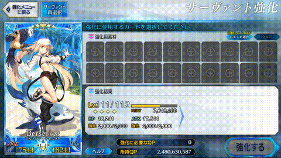

## 2138
2025-08-28
- Update dependency androidx.compose:compose-bom to v2025.08.01 (#724) (@renovate[bot])
- Update lifecycle to v2.9.3 (#725) (@renovate[bot])
- chore: use default material3 typography (#726) (@ArthurKun21)
- fix: Updated Mighty chain logic (@Vylantze)
- fix(Teapots): Update the detection region for wide screen (#727) (@ArthurKun21)

[Compare changes](https://github.com/ArthurKun21/fga-preview/compare/64db6921...7e5a2fe0)
## 2133

2025-08-25

- Update actions/setup-java action to v5 (#718) (@renovate[bot])
- Update dependency com.github.ArthurKun21:compose-overlay-window to v1.5.0 (#719) (@renovate[bot])
- Update hilt to v2.57.1 (#716) (@renovate[bot])
- fix: Skill window not closing during cooldown (#720) (@erectorOps)
- refactor(overlay): Update overlay UI and state management (#717) (@ArthurKun21)
- feat(overlay): Add keyboard support for Support Image Maker (#722) (@ArthurKun21)
- feat: basic Mighty chain implementation (@Vylantze)

[Compare changes](https://github.com/ArthurKun21/fga-preview/compare/735e550e...64db6921)

### Fixes

- Update the location to close the skill window during cooldown @erectorOps

#### Support Image Maker

- Added keyboard support when using mobile devices. Now it will show up.
- Fixed the Close Icon button to empty the string instead of reseting to default string
- Minor UI update with Support Image Maker, now uses full screen dialog.

  

### Features

#### Overlays

- Overlays are now Full screen dialog

  

- Play Button and overlay launchers will follow the system theme

  

#### Mighty Chain

- Experimental new feature: Mighty Chain by @Vylantze

  

## 2126

2025-08-20

- chore: fix lint errors (#714) (@ArthurKun21)
- fix(Tesseract): move TessBaseAPI inside the thread dispatcher (#715) (@ArthurKun21)

[Compare changes](https://github.com/ArthurKun21/fga-preview/compare/0900ecc0...735e550e)

### Fixes

- Move the initialization of tesseract to its designated thread.

## 2124

2025-08-19

- feat(support): add Summer Tiamat template image (#710) (@ArthurKun21)
- chore: update compile sdk to android 16 (#713) (@ArthurKun21)
- Update dependency com.android.tools.build:gradle to v8.12.1 (#711) (@renovate[bot])
- Update dependency androidx.core:core-ktx to v1.17.0 (#693) (@renovate[bot])

[Compare changes](https://github.com/ArthurKun21/fga-preview/compare/d0860904...0900ecc0)

### Updates

- Added Summer Tiamat to servant template images

> [!IMPORTANT]
>
> After the installation of the APK, you have to go to `Settings` -> `Storage` -> `Extract Default Support images`

- Increase the SDK to API Level 36(Android 16). Let me know if there are some problems.

## 2120

2025-08-17

- chore(deps): downgrade  tesseract from multi-core to single core (#706) (@ArthurKun21)
- fix(Tesseract): update tesseract initialization from singleton to service scoped (#707) (@ArthurKun21)
- feat: Add Toggle for using OCR on Apple count (#708) (@ArthurKun21)
- refactor(Tesseract): optimize regex initialization and improve error handling (#709) (@ArthurKun21)

[Compare changes](https://github.com/ArthurKun21/fga-preview/compare/16a1815a...d0860904)

### Fixes

- Not optimized initialization of Tesseract caused some devices to crash.
- We were using too much threads for Tesseract. Moved the Tesseract back with others to the service scoped threads.
- Added some excpetion handling for Tesseract and optimized the initilization of regex for reused.

### Feature

#### Use OCR on Apple Count

- Crash on Apple Refill screen is due to Tesseract crashing. We have now added a new option to skip the usage of OCR for more accurate reading of apples used.

  

  This is found on `settings` -> `Battle` -> `Use OCR on Apple Count`.

  In case you didn't knew, Enabling `Over Recharge AP` would use the max apples available when refilling apples instead of normally only using 1 at a time.

  

## 2116

2025-08-15

- Update dependency androidx.compose:compose-bom to v2025.08.00 (#692) (@renovate[bot])
- fix(Grand): Add clarification about Grand Servant Tags (#694) (@ArthurKun21)
- feat: decouple Gestures from direct Accessibility Service dependency (#695) (@ArthurKun21)
- feat: update TapperService state handling and lifecycle cleanup (#697) (@ArthurKun21)
- Update kotlin monorepo to v2.2.10 (#696) (@renovate[bot])
- fix(LevelServant): JP - Added handler for the temporary servant dialog (#701) (@ArthurKun21)
- feat(Grand): added the grand extra icon (#702) (@ArthurKun21)
- feat(Skill Maker): Added Summer Shiki (#703) (@ArthurKun21)
- feat(Skill Maker): Update UI with Servant Icons (#704) (@ArthurKun21)
- fix: correct preferred UI logic for showing Grand Servant Icons (#705) (@ArthurKun21)

[Compare changes](https://github.com/ArthurKun21/fga-preview/compare/69af606a...16a1815a)

- Perform some minor UI tweaks here and there
- Updated and perform some cleanup on codebase

### Fixes

#### Grand Servant Tag

- Added clarification that the Grand Servant Tag currently only works on Grand Duels
  
  

- Updated the text of the last option to further clarify what it means.

  

#### Level Servant Script
- Fixed the "execute" button not being handled for welfare servants
- Also tested that the trial welfare servant will correctly stop the script once it reached its max level. We weren't sure due to the UI change.

#### Skill Maker
- Added Button hints for Shiki. But if you ever don't want to upgrade yet you can use Dante's options in the mean time.

  

- Added various servant icons to help you decide the button to choose. Also you can't click on that servant icons.

  

- Fixed the buttons hint are only occupying the current space, we have now made it so it can go beyond the screen. Sorry about that.

## 2106
2025-08-12
- refactor: update GameServer from sealed class to enum (#686) (@ArthurKun21)
- fix: update teapots logic (#687) (@ArthurKun21)
- fix: run Tesseract operations on a dedicated thread (#688) (@ArthurKun21)
- Update actions/checkout action to v5 (#689) (@renovate[bot])
- fix(Grand): Update the detection regions for Grand Servant Supports (#690) (@ArthurKun21)
- fix(Grand): Update detection regions for Support Image Maker (#691) (@ArthurKun21)

[Compare changes](https://github.com/ArthurKun21/fga-preview/compare/58c5ed15...69af606a)

Fixes:

### Teapots Fix

- It is now back to just normal turn on or off

  
  
- It will now always check the teapots section at party and repeat screen, if it needs to turn on or off depending if you check ✅ the usage
- If you are on the last run and you still have remaining teapots in the configuration, it will now attempt to turn it off regardless.
  This should help you ~~and me~~ to not accidentally use Teapots on non-high bond quests.
- The above condition doesn't apply to Ordeal Call Free Quest if you ran out of Storm Pods, as we have no way of turning it off once the quests ends.

### Grand Servants Fix

- We have updated the detection regions for both normal as well as support image maker.
- Removed the warning for `Above lvl 100` with the new updated detection region as it seems fairly consistent at Grand Duels
  
  

Experiment:
- We have introduced a dedicated thread to Tesseract(OCR) to check if it will improve the NP level detection. As well as we have updated its detection region.
  Let me know if it somehow improved.
  
## 2100
2025-08-10
- refactor: update SupportBounds as value class (#684) (@ArthurKun21)
- fix: add support for Support Image Maker for Grand Servants in support screen (#685) (@ArthurKun21)

[Compare changes](https://github.com/ArthurKun21/fga-preview/compare/eec23e1e...58c5ed15)

Fixes:
- Added support for getting support images from grand servants. You can now get the CE and Friend as support images aside from the already supported Servant

> [!Note]
> Be aware that only the **slot 1** for CEs of Grand Servant is supported for the new implementation.

## 2098
2025-08-10
- feat: replace volatile variables with atomic types (#680) (@ArthurKun21)
- feat: migrate highlight functionality to AndroidExecutor interface (#681) (@ArthurKun21)
- fix: resolve sequence consumption issues in image match highlighting (#683) (@ArthurKun21)

[Compare changes](https://github.com/ArthurKun21/fga-preview/compare/11839899...eec23e1e)

Fixes:
- Accidentally flip the hiding condition for the play button resulting in play button still showing on vertical mode.
- Improve the image matching operations by removing the redundant operation cause by kotlin sequence and "also" operator

## 2095
2025-08-09
- fix(levelCE): JP - always enable auto fill state even if skip filter is ON (#675) (@ArthurKun21)
- feat!: removal of root screenshot feature (#676) (@ArthurKun21)
- fix(Grand): corrected search region calculation for friend search (#679) (@ArthurKun21)

[Compare changes](https://github.com/ArthurKun21/fga-preview/compare/e6930503...11839899)

Fixes:
- disabling the skip filter for JP will cause an infinite loop on CE leveling, now it will always auto ON the auto fill
- Made a mistake when translating my jupyter notebook for experiment to the app code that cause incorrect detection area for searching friends with grand servants. We have now fixed it

Breaking:
- We are now removing the root screenshot feature for future improvement of codebase.

## 2092
2025-08-06
- feat: Migrated from Timber to Square Logcat (#673) (@ArthurKun21)
- revert: Mihon's crash handling activity with log dumping functionality (#674) (@ArthurKun21)

[Compare changes](https://github.com/ArthurKun21/fga-preview/compare/90bad108...e6930503)

Saw some reports with crashing and going to disable this for a while.

For context, this runs in the background using kotlin thread. And this might be a problem when paired with the 
kotlin coroutines, which where automation scripts run with, both fighting for the same resources causing a crash.

## 2090
2025-08-06
- feat: add default and reset buttons to battle launcher (#667) (@ArthurKun21)
- fix(Grand): Update Grand Servant NP Level Region detection (#669) (@ArthurKun21)
- fix(Grand): is Max Ascended now adjusted for Grand Servants (#670) (@ArthurKun21)
- fix(Grand): add force check if Grand Servant should only be picked. (#671) (@ArthurKun21)
- feat(Support): Added new support servant template images (#672) (@ArthurKun21)

[Compare changes](https://github.com/ArthurKun21/fga-preview/compare/5ef62ae8...90bad108)

Return back the `Reset All` to its old functionality and introduce a new button `Default` in which will now inherit the returning of values to their default value.

---

Fix the is Max ascended for the Grand Servants. This is causing issues the last few grand duels 
if you turn it on due to the fact that it wasn't adjusted for the Grand Servants.

Notice that the `Max ascended` star is a lot lower on the Grand Servant than Normal Servant.

We have now taken into account both situations.

| Grand Servant | Normal Servant|
|:--:|:--:|
|  |  |

---

We have made a mistake in the previous logic for the Grand Servants selection. 
Before even if you set it up to select Grand Servants there's a chance to select
a normal version of it.

| Grand Servant | Normal Servant|
|:--:|:--:|
|  |  |

We have now updated the logic that if you set it up to find Grand Servant it would check for Grand Servant Settings

Such Settings are any of the following:
- You have selected to find if there's Bond CE/NP Charge on Slot 2
- You have setup to find a CE on Slot 3
- You are searching for either Grand Servant Tag(Fixed lvl 100 or Lvl 100 and above)

---

The following are now added to Default Support Servants to help to the upcoming Extra 1 Grand Duel and beyond
- Mash
- Jalter
- Arcueid
- Kagetora (Ruler)
- Ciel
- BB Dubai
- U-Olga Marie

> [!IMPORTANT]
> After the installation of the APK, you have to go to `Settings` -> `Storage` -> `Extract Default Support images`

## 2085
2025-08-04
- feat: add Mihon's crash handling activity with log dumping functionality (#663) (@ArthurKun21)
- chore: Update project structure for App module  (#664) (@ArthurKun21)
- fix: add lower bounds to play button to prevent negative coordinates (#665) (@ArthurKun21)
- Update dependency org.junit:junit-bom to v5.13.4 (#655) (@renovate[bot])
- Update dependency com.diffplug.spotless:spotless-plugin-gradle to v7.2.1 (#656) (@renovate[bot])
- Update dependency com.pinterest.ktlint:ktlint-cli to v1.7.1 (#657) (@renovate[bot])

[Compare changes](https://github.com/ArthurKun21/fga-preview/compare/71d99215...5ef62ae8)

App was crashing when starting the script service. This is a side-effect code to fix the initialization of play button.
Due to bug in the code it causes to have negative left location causing the crash. We have now added a lower bound in order to prevent that.

---

We have copied code from Mihon's codebase in order to display some crashing issues.

---

Finally figured out what was wrong with my code and it is no longer ugly again.

## 2079
2025-08-03
- ci: remove unused github action workflows (@ArthurKun21)
- chore(deps): Update dependency com.cheonjaeung.compose.grid:grid to v2.4.0 (#660) (@renovate[bot])
- chore: Update project structure for Scripts module (#661) (@ArthurKun21)
- feat(LevelServant): implement JP's extra embers/qp refund mechanism handler (#662) (@ArthurKun21)

JP have now implemented a refund window that show the extra Embers/QP. This makes the script quit due to
sharing the same window with out of ember/qp. We have now implemented a handler to hopefully handle this

[Compare changes](https://github.com/ArthurKun21/fga-preview/compare/7afa3bdd...71d99215)
## 2075
2025-08-01
- fix: return the image pattern used for NA's servant level (#659) (@ArthurKun21)

[Compare changes](https://github.com/ArthurKun21/fga-preview/compare/1e5c8503...7afa3bdd)
## 2074
2025-08-01
- chore: refactor battle launcher code to reused the same config (#641) (@ArthurKun21)
- feat: moved the auto send friend request from per server preference to per battle config (#642) (@ArthurKun21)
- fix: overlay play button initialization failure (#627) (@ArthurKun21)
- feat: consider out of commands as also off script exception (#643) (@ArthurKun21)
- feat: save command spell region upon detection (#644) (@ArthurKun21)
- chore(deps): bump gradle from 8.14.3 to 9.0.0 (#646) (@ArthurKun21)
- chore: Configure Renovate (#647) (@renovate[bot])
- chore(deps): update dependency androidx.navigation:navigation-compose to v2.9.3 (#648) (@renovate[bot])
- chore(deps): update dependency androidx.work:work-runtime to v2.10.3 (#649) (@renovate[bot])
- chore: disable semantic commits in Renovate configuration (@ArthurKun21)
- chore(deps): bump agp from 8.11.1 to 8.12.0 (@ArthurKun21)
- Update hilt to v2.57 (#654) (@renovate[bot])
- feat: add support for missing Grand Servants' text information (#645) (@ArthurKun21)

[Compare changes](https://github.com/ArthurKun21/fga-preview/compare/18da5b64...1e5c8503)

### Updated the Support Text Information

Updated the UI to also display the full information including Grand Servant Configuration

#### Battle Configuration Screen

#### Battle Launcher

### Auto Send Friend Request is now per battle config

It has now been migrated from per server configuration into per battle configuration

#### Battle Configuration Screen

#### Battle Launcher

## 2061
2025-07-30
- feat: Implement Default Run Configuration per battle config (#634) (@ArthurKun21)
- chore(deps): bump okio from 3.15.0 to 3.16.0 (#636) (@dependabot[bot])
- feat(LevelServant): Add support for JP's new UI update and auto fill embers (#637) (@ArthurKun21)
- feat(LevelCE): Add support for JP's new UI update and auto fill CEs (#638) (@ArthurKun21)
- fix(AutoFriendGacha): remove settings in launcher with respect to auto fill CEs (#639) (@ArthurKun21)
- fix: forgot to remove some launcher settings (#640) (@ArthurKun21)

[Compare changes](https://github.com/ArthurKun21/fga-preview/compare/ee232491...18da5b64)

### Default Run configuration

The initial value of per item in the configuration will always be "1" but by resetting in the battle launcher it would then reset to whatever default value you inputted.

Whenever you completed your inputted number of runs, it would also reset to whatever default you have inputted instead of "1"

### Auto Level Servant for JP

It has now been optimized to use the newly added auto fill embers

> [!WARNING]
> Haven't tested with the temporary servants such as welfares at the time of creating this feature. As such may fail, please be advised.

### Auto Level CE for JP

It has now been optimized to use the newly added auto fill CEs

## 2055
2025-07-29
- revert: update project dependencies to remove gradle's type-safe accessors (#632) (@ArthurKun21)
- fix: add support for CN's 15 party slot (#633) (@ArthurKun21)

[Compare changes](https://github.com/ArthurKun21/fga-preview/compare/5f7bb6ef...ee232491)
## 2053
2025-07-29
- fix: update the CN repeat button location (#631) (@ArthurKun21)

[Compare changes](https://github.com/ArthurKun21/fga-preview/compare/5ca9863b...5f7bb6ef)
## 2052
2025-07-28
- ci: Update the PR Build workflow condition (@ArthurKun21)
- feat: add optional toggle to always stopping accessibility service (#612) (@ArthurKun21)
- chore: remove unused KnownException references from exit handling (#613) (@ArthurKun21)
- fix: update parameter annotations to use @param syntax (#614) (@ArthurKun21)
- feat: moved Fine Tune to Home Screen (#615) (@ArthurKun21)
- chore(deps): bump coil from 3.2.0 to 3.3.0 (#622) (@dependabot[bot])
- fix: simplify Settings screen navigation (#621) (@ArthurKun21)
- fix: add library tabs to the settings (#620) (@ArthurKun21)
- chore(deps): bump agp from 8.11.0 to 8.11.1 (@ArthurKun21)
- chore(deps): bump gradle wrapper from 8.14.1 to 8.14.3 (@ArthurKun21)
- chore(deps): bump lifecycle from 2.9.0 to 2.9.2 (@ArthurKun21)
- chore(deps): bump appcompat from 1.7.0 to 1.7.1 (@ArthurKun21)
- chore(deps): bump workmanager from 2.10.1 to 2.10.2 (@ArthurKun21)
- chore(deps): bump compose_bom from 2025.05.01 to 2025.07.00 (@ArthurKun21)
- chore(deps): bump navigation_compose from 2.9.0 to 2.9.2 (@ArthurKun21)
- chore(deps): bump mockk from 1.14.4 to 1.14.5 (@ArthurKun21)
- chore(deps): bump junit_bom from 5.13.2 to 5.13.3 (@ArthurKun21)
- chore(deps): bump spotless from 7.0.4 to 7.1.0 (@ArthurKun21)
- refactor: migrate skill maker activity to compose (#625) (@ArthurKun21)
- feat: set always return to menu as the default (#626) (@ArthurKun21)
- fix: correct proguard rules for model and enum classes (#628) (@ArthurKun21)
- chore: refactor project to make some functions reusable  (#630) (@ArthurKun21)

Library tabs will now display all of the servers tabs. If you want to disable some of the server tabs go to settings -> library -> library tabs and disable the ones you don't want to see.

---

There's now a new setting to disable auto stop of accessibility service when the script was stopped.

Go to settings -> advanced -> "Auto stop accessibility service on script service stop"

---

Battle script will now automatically return to menu when the script ends instead of staying on the repeat screen.

To disable it, on the battle launcher

Click Settings(Gear) -> disable "return to main screen"

[Compare changes](https://github.com/ArthurKun21/fga-preview/compare/7e2871ec...5ca9863b)
## 2030
2025-07-20
- feat: migrate Run Configuration to per Battle Config (#606) (@ArthurKun21)
- ci: update github actions to reenable PR builds (@ArthurKun21)
- ci: update dependabot pr request limit (@ArthurKun21)
- ci: fix the PR Build workflow (@ArthurKun21)
- chore: update gradle.properties for improved configuration settings (@ArthurKun21)
- fix: optimized storage read-write with okio (#607) (@ArthurKun21)
- chore(deps): bump com.github.ArthurKun21:compose-overlay-window from 1.1.0 to 1.1.1 (#609) (@dependabot[bot])
- feat: Hide SQ from resources by default (#610) (@ArthurKun21)
- chore(deps): bump org.jetbrains.kotlinx:kotlinx-datetime from 0.7.0 to 0.7.1 (#592) (@dependabot[bot])

[Compare changes](https://github.com/ArthurKun21/fga-preview/compare/fcc603f1...7e2871ec)
## 2021
2025-07-17
- refactor: migrate from prefs to data module (#598) (@ArthurKun21)
- feat: add image resources for Grand Lancer and Grand Berserker (#600) (@ArthurKun21)
- feat(support): add Bhima, Melusine, and Scathach support servant images (#601) (@ArthurKun21)
- fix: Preferred Support not refreshing after support image extraction (#602) (@ArthurKun21)
- fix(Support Image Maker): image cache invalidation to display the right support image (#603) (@ArthurKun21)
- feat(Support Image Maker): added hints to enable non-emulator to use the script (#604) (@ArthurKun21)
- fix(Battle): adjust apple refill timing for Grand Duels and Ordeal Call FQ (#605) (@ArthurKun21)

[Compare changes](https://github.com/ArthurKun21/fga-preview/compare/b588b2bc...fcc603f1)
## 2014
2025-07-15
- chore(deps): bump com.diffplug.spotless:spotless-plugin-gradle from 7.0.3 to 7.0.4 (#567) (@dependabot[bot])
- chore(deps): bump io.mockk:mockk from 1.14.2 to 1.14.4 (#584) (@dependabot[bot])
- chore(deps): bump kotlin from 2.1.21 to 2.2.0 (#585) (@dependabot[bot])
- chore(deps): bump com.google.devtools.ksp:symbol-processing-gradle-plugin from 2.1.21-2.0.2 to 2.2.0-2.0.2 (#587) (@dependabot[bot])
- chore(deps): bump org.junit:junit-bom from 5.13.1 to 5.13.2 (#586) (@dependabot[bot])
- chore(deps): bump agp from 8.10.1 to 8.11.0 (#590) (@ArthurKun21)
- chore(deps): bump org.jetbrains.kotlinx:kotlinx-datetime from 0.6.2 to 0.7.0 (#591) (@ArthurKun21)
- chore(deps): bump org.opencv:opencv from 4.11.0 to 4.12.0 (#595) (@dependabot[bot])
- fix(Tesseract): Extraction and verification of tesseract data (#596) (@ArthurKun21)

[Compare changes](https://github.com/ArthurKun21/fga-preview/compare/e2eb2b5e...b588b2bc)
## 2005
2025-06-20
- chore(deps): bump org.junit:junit-bom from 5.12.2 to 5.13.0 (#571) (@dependabot[bot])
- refactor: move enums and classes to models module (#574) (@ArthurKun21)
- refactor: moved components to libautomata (#576) (@ArthurKun21)
- chore: split screenshot and recording into separate classes (#577) (@ArthurKun21)
- chore(deps): bump compose-bom from 2025.05.00 to 2025.05.01 (@ArthurKun21)
- chore(deps): bump agp from 8.10.0 to 8.10.1 (@ArthurKun21)
- chore(deps): bump org.junit:junit-bom from 5.13.0 to 5.13.1 (#579) (@dependabot[bot])
- chore(deps): bump sh.calvin.reorderable:reorderable from 2.4.3 to 2.5.1 (#580) (@dependabot[bot])
- chore(deps): bump com.google.devtools.ksp:symbol-processing-gradle-plugin from 2.1.21-2.0.1 to 2.1.21-2.0.2 (#581) (@dependabot[bot])
- chore(deps): bump cz.adaptech.tesseract4android:tesseract4android-openmp from 4.8.0 to 4.9.0 (#582) (@dependabot[bot])
- feat(support): added Zerktoria and Lilith template images (#583) (@ArthurKun21)

[Compare changes](https://github.com/ArthurKun21/fga-preview/compare/6b0d9791...e2eb2b5e)
## 1994
2025-05-28
- chore: Update logging for scripts module (#568) (@ArthurKun21)
- fix: handle app freezing when stopping certain scripts (#569) (@ArthurKun21)

[Compare changes](https://github.com/ArthurKun21/fga-preview/compare/68dd1e78...6b0d9791)
## 1992
2025-05-28
- fix(gradle): Create task to make git and configuration-cache compatible (#562) (@ArthurKun21)
- chore(gradle): Update Accessibility task to use ExecOperations (#564) (@ArthurKun21)
- chore(deps): bump gradle wrapper from 8.14 to 8.14.1 (#565) (@ArthurKun21)
- chore: convert modules to android library (#563) (@ArthurKun21)
- fix(support): Grand Servant Bond CE Selector (#566) (@ArthurKun21)

[Compare changes](https://github.com/ArthurKun21/fga-preview/compare/726daa1f...68dd1e78)
## 1987
2025-05-26
- feat: add step buttons for adjusting max gold ember total count (@ArthurKun21)
- feat: Update Preferred Support UI (#554) (@ArthurKun21)
- feat(support): Split Slot 1 and 3 CE selection for grand servant (#555) (@ArthurKun21)
- feat(support): Grand Servant CE Slot 2 selection (#556) (@ArthurKun21)
- fix(support): wrong region clipping leads to unable to find 3 Grand Servant CE (#557) (@ArthurKun21)
- feat(support): Grand Servant NP Level detection (#558) (@ArthurKun21)
- fix: add weight in the party and server dialog (#559) (@ArthurKun21)
- feat: remove requirement to set GrandServant type before seeing slot 2 and 3 CE (#560) (@ArthurKun21)
- feat(support): handle new support popup (#561) (@ArthurKun21)

[Compare changes](https://github.com/ArthurKun21/fga-preview/compare/f769d72d...726daa1f)
## 1978
2025-05-24
- fix: update game server check for Grand Servant CE logic (@ArthurKun21)
- chore: streamline Permissions (#549) (@ArthurKun21)
- chore: streamline theme and language preferences (#550) (@ArthurKun21)
- feat(support): implement search friend in new grand servant UI (#551) (@ArthurKun21)
- fix: race condition on floating window (#552) (@ArthurKun21)
- fix: Ordeal Call and Teapots for EN (#553) (@ArthurKun21)

[Compare changes](https://github.com/ArthurKun21/fga-preview/compare/2f088460...f769d72d)
## 1972
2025-05-23
- chore: simplify workflow scripts (#541) (@ArthurKun21)
- feat: introduce buildSrc for project management (#542) (@ArthurKun21)
- fix: hilt misconfiguration on buildSrc (#544) (@ArthurKun21)
- chore: add matchingFallbacks for alpha build (@ArthurKun21)
- feat(support): Implement searching for Grand Servants (#547) (@ArthurKun21)
- feat(support): implement temporary ce selection when using grand servant (#548) (@ArthurKun21)

[Compare changes](https://github.com/ArthurKun21/fga-preview/compare/db35f981...2f088460)
## 1966
2025-05-19
- chore(deps): bump kotlin from 2.1.20 to 2.1.21 (@dependabot[bot])
- chore(deps): bump com.google.devtools.ksp from 2.1.20-2.0.1 to 2.1.21-2.0.1 (@dependabot[bot])
- chore(deps): bump coil from 3.1.0 to 3.2.0 (@dependabot[bot])
- fix: face card detection, only JP and CN have updated ver (#528) (@ArthurKun21)
- chore(deps): bump agp from 8.9.2 to 8.10.0 (@ArthurKun21)
- chore(deps): bump compose_bom from 2025.04.01 to 2025.05.00 (@ArthurKun21)
- chore(deps): bump navigation_compose from 2.8.9 to 2.9.0 (@ArthurKun21)
- chore(deps): bump lifecycle from 2.8.7 to 2.9.0 (@ArthurKun21)
- chore(deps): bump workmanager from 2.10.0 to 2.10.1 (@ArthurKun21)
- feat: switch to tesseract openmp for better performance (#532) (@ArthurKun21)
- feat: Update to use collectAsStateWithLifecycle (#536) (@ArthurKun21)
- feat: Update Dialogs UI (#537) (@ArthurKun21)
- feat: Use Compose Overlay Window for Play Button (#539) (@ArthurKun21)
- feat: Update App icons and introduce monochrome icon (#540) (@ArthurKun21)

[Compare changes](https://github.com/ArthurKun21/fga-preview/compare/3519489b...db35f981)
## 1952
2025-05-11
- feat: added angra to skill maker (#520) (@ArthurKun21)
- feat: Update Onboarding screen (#521) (@ArthurKun21)
- fix: onboarding not setting to be completed on finished (#522) (@ArthurKun21)
- feat(AutoLevelServant): Start script at Grail menu to return to Servant menu (#523) (@ArthurKun21)

[Compare changes](https://github.com/ArthurKun21/fga-preview/compare/ef20a1d9...3519489b)
## 1948
2025-05-05
- fix: manage Tesseract state on closing (#517) (@ArthurKun21)
- fix: ensure proper copying of Tesseract data files (#519) (@ArthurKun21)

[Compare changes](https://github.com/ArthurKun21/fga-preview/compare/66c8521b...ef20a1d9)
## 1946
2025-05-05
- fix: Incorrectly closed resources, preventing the play button from reappearing (#516) (@ArthurKun21)

[Compare changes](https://github.com/ArthurKun21/fga-preview/compare/2ae931bb...66c8521b)
## 1945
2025-05-05
- chore(deps): bump agp from 8.9.1 to 8.9.2 (#513) (@ArthurKun21)
- fix: android 14+ crash (#514) (@ArthurKun21)
- fix: android 14+ workmanager notification permission error (#515) (@ArthurKun21)

[Compare changes](https://github.com/ArthurKun21/fga-preview/compare/f333cec8...2ae931bb)
## 1942
2025-05-04
- fix: update Face Card Details Region for non-EN regions (#503) (@ArthurKun21)
- chore(deps): bump io.mockk:mockk from 1.14.0 to 1.14.2 (@dependabot[bot])
- fix: update teapots usage to neutral when resetting (#505) (@ArthurKun21)
- chore: clean up .gitignore files by removing redundant build entries (@ArthurKun21)
- chore(deps): bump com.google.devtools.ksp from 2.1.20-2.0.0 to 2.1.20-2.0.1 (@dependabot[bot])
- chore: update skill confirmation template image (CN) (@ArthurKun21)
- chore(deps): bump gradle/actions/wrapper-validation from v3 to v4 (#511) (@ArthurKun21)
- feat: added OC4 mats (#510) (@ArthurKun21)

[Compare changes](https://github.com/ArthurKun21/fga-preview/compare/7cf94e95...f333cec8)
## 1934
2025-04-29
- chore(deps): bump com.google.accompanist:accompanist-permissions from 0.37.2 to 0.37.3 (@dependabot[bot])
- feat(AutoGiftBox): added silver embers count (#498) (@ArthurKun21)
- chore: update AutoLottery to GiftBox template image (#501) (@ArthurKun21)
- fix: Prevent OC teapots from being incorrectly enabled in subsequent runs (#502) (@ArthurKun21)
  - Added explanation: If you have storm pods and used them with teapots. When you ran out of storm pods, you would return back to menu and the next time you have did runs the teapots are turned on but the Teapots mode in the app is on neutral, meaning it won't alter the state of the teapots. Meaning you might accidentally use teapots even if you don't want to. This change will make the Teapots mode to turned off, meaning it will check and if it was turned on it would turned it off, to prevent accidental usage.

[Compare changes](https://github.com/ArthurKun21/fga-preview/compare/105c8272...7cf94e95)
## 1930
2025-04-28
- fix: False Lotto Detection(EN/JP server) (#495) (@ArthurKun21)

[Compare changes](https://github.com/ArthurKun21/fga-preview/compare/10f29abe...105c8272)
## 1929
2025-04-28
- fix: temporary increase delay on opening master skill menu (#489) (@ArthurKun21)
- chore(deps): bump hilt from 2.56.1 to 2.56.2 (@dependabot[bot])
- chore(deps): bump compose_bom from 2025.04.00 to 2025.04.01 (@ArthurKun21)
- chore(deps): bump gradle wrapper from 8.13 to 8.14 (#492) (@ArthurKun21)
- fix: relocate help rearrange cards URL to the correct section (#493) (@ArthurKun21)
- chore(deps): update dependabot schedule from weekly to daily (@ArthurKun21)
- chore: Improve GitHub related items (#494) (@ArthurKun21)
- feat: optimize concurrency with coroutine migration (#485) (@ArthurKun21)

[Compare changes](https://github.com/ArthurKun21/fga-preview/compare/8cdffe55...10f29abe)
## 1921
2025-04-15
- feat: start at support after the repeat quest (#472) (@ArthurKun21)
- chore(deps): bump org.jetbrains.kotlinx:kotlinx-serialization-json from 1.8.0 to 1.8.1 (@dependabot[bot])
- refactor: update gradle build configuration and dependencies (#473) (@ArthurKun21)
- refactor: update composition state management (#475) (@ArthurKun21)
- chore: upgrade Java in gradle from 11 to 17 (#476) (@ArthurKun21)
- chore: remove ndkVersion from build.gradle.kts (#477) (@ArthurKun21)
- chore(deps): bump io.mockk:mockk from 1.13.17 to 1.14.0 (@dependabot[bot])
- chore(deps): bump org.jetbrains.kotlinx:kotlinx-coroutines-core from 1.10.1 to 1.10.2 (@dependabot[bot])
- chore(deps): bump org.junit:junit-bom from 5.12.1 to 5.12.2 (@dependabot[bot])
- chore(deps): bump com.google.devtools.ksp from 2.1.20-1.0.32 to 2.1.20-2.0.0 (@dependabot[bot])
- fix: initial 100 FP Gacha (#482) (@ArthurKun21)

[Compare changes](https://github.com/ArthurKun21/fga-preview/compare/55fdfc05...8cdffe55)
## 1910
2025-04-02
- feat: use ai generated translations (#457) (@ArthurKun21)
- fix: reserved character causing build error (#458) (@ArthurKun21)
- feat: Replace local images with link urls (#459) (@ArthurKun21)
- feat: implement image loading optimization with LruCache (#460) (@ArthurKun21)
- chore: Update Gradle config (#461) (@ArthurKun21)
- feat: implement asynchronous file logging (#462) (@ArthurKun21)
- chore: refactor code to split the notification and logging for scripts (#463) (@ArthurKun21)
- chore: cleanup unnecessary script (#464) (@ArthurKun21)
- chore: reduce accessibility service permissions (#465) (@ArthurKun21)
- chore: added safety checks for accessiblity service (#466) (@ArthurKun21)
- chore(deps): bump ksp from 2.1.20-1.0.31 to 2.1.20-1.0.32 (@dependabot[bot])
- chore(deps): bump hilt from 2.56 to 2.56.1 (@dependabot[bot])
- chore(deps): bump androidx.compose:compose-bom from 2025.03.00 to 2025.03.01 (@dependabot[bot])

[Compare changes](https://github.com/ArthurKun21/fga-preview/compare/7c4be32a...55fdfc05)
## 1897
2025-03-29
- chore: refactor class names and functions (#446) (@ArthurKun21)
- chore(deps): bump kotlin from 2.1.10 to 2.1.20 (@dependabot[bot])
- chore(deps): bump ksp from 2.1.10-1.0.31 to 2.1.20-1.0.31 (@dependabot[bot])
- chore(deps): bump com.android.tools.build:gradle from 8.9.0 to 8.9.1 (@dependabot[bot])
- chore(deps): bump hilt from 2.55 to 2.56 (@dependabot[bot])
- chore(deps): bump gradle from 8.12 to 8.13 (@ArthurKun21)
- chore: update .gitignore to ignore all files in .idea except icon.png (@ArthurKun21)
- feat: update to use SpecialSkill.Transform and deprecate Transform (#447) (@ArthurKun21)
- chore: convert actions from stateflow to sharedflow (#448) (@ArthurKun21)
- fix: update proguard rules (#449) (@ArthurKun21)
- chore: convert parameter to duration (#451) (@ArthurKun21)
- fix: unreleased Mat instances (#453) (@ArthurKun21)
- feat: always disable AccessibilityService when stopping Script Service (#454) (@ArthurKun21)
- feat!: temp disable daily reset handler (#455) (@ArthurKun21)
- fix(NA): Broken skill confirm check (#456) (@ArthurKun21)

[Compare changes](https://github.com/ArthurKun21/fga-preview/compare/a6599f8f...7c4be32a)
## 1882
2025-03-24
- feat(manifest): add internet and network state permissions (@ArthurKun21)
- feat: Backup and Restore Settings (#420) (@ArthurKun21)
- chore(deps): bump activity from 1.10.0 to 1.10.1 (@dependabot[bot])
- chore(deps): bump ksp from 2.1.10-1.0.30 to 2.1.10-1.0.31 (@dependabot[bot])
- chore(deps): bump com.android.tools.build:gradle from 8.8.1 to 8.8.2 (@dependabot[bot])
- chore(deps): bump org.junit:junit-bom from 5.11.4 to 5.12.0 (@dependabot[bot])
- chore(deps): bump io.mockk:mockk from 1.13.16 to 1.13.17 (@dependabot[bot])
- fix: Start Service race conditon (#421) (@ArthurKun21)
- feat: Update the default detail screen to Battle for Expanded Settings Screen (#422) (@ArthurKun21)
- feat(Skill Maker): Update Support for Dante Alighieri (#423) (@ArthurKun21)
- feat(ui): Update Skill Maker ui (#424) (@ArthurKun21)
- fix: misc code fix (#425) (@ArthurKun21)
- fix: data class state incorrectly updated (@ArthurKun21)
- chore(deps): bump androidx.navigation:navigation-compose from 2.8.7 to 2.8.8 (@dependabot[bot])
- chore(deps): bump com.android.tools.build:gradle from 8.8.2 to 8.9.0 (@dependabot[bot])
- chore(deps): bump androidx.navigation:navigation-compose from 2.8.8 to 2.8.9 (@dependabot[bot])
- chore(deps): bump org.junit:junit-bom from 5.12.0 to 5.12.1 (@dependabot[bot])
- chore(deps): bump androidx.compose:compose-bom from 2025.02.00 to 2025.03.00 (@dependabot[bot])
- fix: compose update changes (#431) (@ArthurKun21)
- feat!: Drop Android 7 Support (#432) (@ArthurKun21)
- feat: Update Level Servant Launcher UI (#433) (@ArthurKun21)
- feat: Update Level CE and FP Launcher UI (#434) (@ArthurKun21)
- chore: refactor Script Exception handling (#435) (@ArthurKun21)
- feat: imperfect handle of daily reset (#436) (@ArthurKun21)
- fix(Teapots): Reset to null after setting it to false (#437) (@ArthurKun21)
- fix: update string resource used to prevent missing args crash (#438) (@ArthurKun21)
- refactor: replace local VerticalDivider import with material3 version (#439) (@ArthurKun21)
- fix: add support for Set type in JSON serialization for Battle Configs (#440) (@ArthurKun21)

[Compare changes](https://github.com/ArthurKun21/fga-preview/compare/230fac58...a6599f8f)
## 1854
2025-02-20
- chore: remove Gson from Project and replace with kotlin serialization (#387) (@ArthurKun21)
- chore(deps): bump ksp from 2.1.10-1.0.29 to 2.1.10-1.0.30 (@dependabot[bot])
- chore(deps): bump androidx.navigation:navigation-compose from 2.8.6 to 2.8.7 (@dependabot[bot])
- chore(deps): bump com.android.tools.build:gradle from 8.8.0 to 8.8.1 (@dependabot[bot])
- chore(deps): bump androidx.compose:compose-bom from 2025.01.00 to 2025.02.00 (@dependabot[bot])
- feat: Update Library Screen (#406) (@ArthurKun21)
- chore: refactor battle config components (#407) (@ArthurKun21)
- feat: Update Material Screen UI logic (#408) (@ArthurKun21)
- chore: update .gitignore to include runConfigurations.xml (@ArthurKun21)
- feat: added background to home and library (#409) (@ArthurKun21)
- feat: Update settings screen UI (#410) (@ArthurKun21)
- fix: Color and Component issue caused by last update (#411) (@ArthurKun21)

[Compare changes](https://github.com/ArthurKun21/fga-preview/compare/2733f065...230fac58)
## 1842
2025-02-17
- fix(Command Spell): Detection in ultra-wide devices (#333) (@ArthurKun21)
- feat!: Remove Spam configuration (#371) (@ArthurKun21)
- fix: replaced the clickable text in onboarding (#372) (@ArthurKun21)
- feat: Update the Command Card Screen (#373) (@ArthurKun21)
- fix: invalid image format (@ArthurKun21)
- fix: Various inconsistencies with the Command Card Screen (#374) (@ArthurKun21)
- feat: Update Fine Tune Screen UI (#376) (@ArthurKun21)
- chore(deps): bump org.jetbrains.kotlinx:kotlinx-datetime from 0.6.1 to 0.6.2 (@dependabot[bot])
- chore(deps): bump coil from 3.0.4 to 3.1.0 (@dependabot[bot])
- chore(deps): bump androidx.navigation:navigation-compose from 2.8.5 to 2.8.6 (@dependabot[bot])
- chore: refactor AutoSkillCommand (#381) (@ArthurKun21)
- feat: allow skipping onboarding items in debug mode (#382) (@ArthurKun21)
- feat Update dialogs UI (#383) (@ArthurKun21)
- feat: Update Command Card Screen UI (#384) (@ArthurKun21)
- feat: Update Support Class Picker UI (#385) (@ArthurKun21)
- fix: navigation backstack error on multiple click event (#386) (@ArthurKun21)

[Compare changes](https://github.com/ArthurKun21/fga-preview/compare/2ca217d5...2733f065)
## 1826
2025-01-31
- fix: Update the deprecated Display metrics (#364) (@ArthurKun21)
- feat(Teapots): New Teapots UI in JP (#368) (@ArthurKun21)
- feat(Support Screen): Minor QoL Improvements (#369) (@ArthurKun21)
- fix: locale positioning warning (#370) (@ArthurKun21)
- fix(Teapots): reduce timeout for popup existence check from 5 seconds to 2 seconds (@ArthurKun21)

[Compare changes](https://github.com/ArthurKun21/fga-preview/compare/ad77672c...2ca217d5)
## 1821
2025-01-31
- chore: Update Home Screen Top Bar UI (#363) (@ArthurKun21)
- chore: Further Update Home Screen UI (#365) (@ArthurKun21)
- chore: Update App Colors (#366) (@ArthurKun21)
- chore: Code Cleanup (#367) (@ArthurKun21)

[Compare changes](https://github.com/ArthurKun21/fga-preview/compare/2a404155...ad77672c)
## 1817
2025-01-30
- fix(MediaProjectionRecording): Update the deprecated Media Recording (#362) (@ArthurKun21)

[Compare changes](https://github.com/ArthurKun21/fga-preview/compare/d25e8130...2a404155)
## 1816
2025-01-30
- refactor(DroidCvPattern): improve logging format for match results (#359) (@ArthurKun21)
- Bump com.github.ben-manes.versions from 0.51.0 to 0.52.0 (#357) (@dependabot[bot])
- Bump kotlin from 2.1.0 to 2.1.10 (#356) (@dependabot[bot])
- Bump ksp from 2.1.0-1.0.29 to 2.1.10-1.0.29 (@ArthurKun21)
- fix(DroidCvPattern): Crash due to region out of bounds (#361) (@ArthurKun21)

[Compare changes](https://github.com/ArthurKun21/fga-preview/compare/33c6da8f...d25e8130)
## 1811
2025-01-29
- fix(AutoBattle): New JP Repeat Button Location (#358) (@ArthurKun21)

[Compare changes](https://github.com/ArthurKun21/fga-preview/compare/6caee4af...33c6da8f)
## 1810
2025-01-26
- Bump activity from 1.9.3 to 1.10.0 (@dependabot[bot])
- Bump androidx.compose:compose-bom from 2024.12.01 to 2025.01.00 (@dependabot[bot])
- Bump org.opencv:opencv from 4.10.0-kleidicv to 4.11.0 (@dependabot[bot])

[Compare changes](https://github.com/ArthurKun21/fga-preview/compare/1ce10c43...6caee4af)
## 1807
2025-01-15
- Bump com.android.tools.build:gradle from 8.7.3 to 8.8.0 (@dependabot[bot])
- Bump io.mockk:mockk from 1.13.14 to 1.13.16 (@dependabot[bot])
- Bump hilt from 2.54 to 2.55 (@dependabot[bot])

[Compare changes](https://github.com/ArthurKun21/fga-preview/compare/9ce128b7...1ce10c43)

## 2025-01-11
- Bump org.jetbrains.kotlinx:kotlinx-serialization-json from 1.7.3 to 1.8.0 (@dependabot[bot])

[Compare changes](https://github.com/ArthurKun21/fga-preview/compare/cd84908b...9ce128b7)

## 2025-01-08
- refactor(Service): replace Service references with application context (#348) (@ArthurKun21)
- fix(Notification): Notification priority causes it to disappear when used often. (#349) (@ArthurKun21)

[Compare changes](https://github.com/ArthurKun21/fga-preview/compare/61b85cc7...cd84908b)

## 2025-01-08
- fix(Support): NP Level Detection for wide screens (#347) (@ArthurKun21)

[Compare changes](https://github.com/ArthurKun21/fga-preview/compare/4836f995...61b85cc7)

## 2025-01-07
- feat(Support): NP Level Detection (#346) (@ArthurKun21)

[Compare changes](https://github.com/ArthurKun21/fga-preview/compare/ce7b51c0...4836f995)

## 2025-01-07
- feat(AutoBattle): Stop on Bond Level up (#345) (@ArthurKun21)

[Compare changes](https://github.com/ArthurKun21/fga-preview/compare/94896252...ce7b51c0)

## 2025-01-03
- feat(AutoFriendGacha): Support for 100x FP (#342) (@ArthurKun21)

[Compare changes](https://github.com/ArthurKun21/fga-preview/compare/2dc72912...94896252)

## 2024-12-31
- fix(Battle Launcher): Negative Apple Count (#341) (@ArthurKun21)

[Compare changes](https://github.com/ArthurKun21/fga-preview/compare/a4bb5830...2dc72912)

## 2024-12-26
- chore(gradle): Update Gradle wrapper to version 8.12 (#337) (@ArthurKun21)
- fix(Library): Unable to perform config export (#339) (@ArthurKun21)

[Compare changes](https://github.com/ArthurKun21/fga-preview/compare/3e190fdb...a4bb5830)

## 2024-12-26
- refactor(Notifications): Updated codebase for notification channels (#335) (@ArthurKun21)
- refactor(storage): Migrate from DocumentFile to UniFile (#336) (@ArthurKun21)

[Compare changes](https://github.com/ArthurKun21/fga-preview/compare/7a1e2381...3e190fdb)

## 2024-12-25
- feat(Support Image Extractor): Moved the Extraction to Work Manager (#334) (@ArthurKun21)

[Compare changes](https://github.com/ArthurKun21/fga-preview/compare/ad26809e...7a1e2381)

## 2024-12-23
- Update dependabot.yml (@ArthurKun21)
- Bump org.jetbrains.kotlinx:kotlinx-coroutines-core from 1.9.0 to 1.10.1 (@dependabot[bot])
- Bump org.junit:junit-bom from 5.11.3 to 5.11.4 (@dependabot[bot])
- Bump cz.adaptech.tesseract4android:tesseract4android from 4.7.0 to 4.8.0 (@dependabot[bot])
- Bump io.mockk:mockk from 1.13.13 to 1.13.14 (@dependabot[bot])
- Bump hilt from 2.53 to 2.54 (@dependabot[bot])
- Bump androidx.navigation:navigation-compose from 2.8.4 to 2.8.5 (@dependabot[bot])
- Bump androidx.compose:compose-bom from 2024.11.00 to 2024.12.01 (@dependabot[bot])

[Compare changes](https://github.com/ArthurKun21/fga-preview/compare/16ae67f6...ad26809e)

## 2024-12-21
- Fix JP Lottery Present Box Full (#324) (@ArthurKun21)
- feat(AutoLottery): Jp lottery long press improvement (#325) (@ArthurKun21)

[Compare changes](https://github.com/ArthurKun21/fga-preview/compare/10fab43a...16ae67f6)

## 2024-12-18
- Fix Toggle Service (#321) (@ArthurKun21)
- Fix Library Select (#322) (@ArthurKun21)
- Update Library Search icons (#323) (@ArthurKun21)

[Compare changes](https://github.com/ArthurKun21/fga-preview/compare/078b3031...10fab43a)

## 2024-12-17
- Support for JP Long Press lottery (#320) (@ArthurKun21)

[Compare changes](https://github.com/ArthurKun21/fga-preview/compare/86122452...078b3031)

## 2024-12-14
- Fix linter error (#316) (@ArthurKun21)
- Library Predefined Server Sort (#317) (@ArthurKun21)
- Fix Library search toggle (#318) (@ArthurKun21)
- Fix sort settings not being saved (#319) (@ArthurKun21)

[Compare changes](https://github.com/ArthurKun21/fga-preview/compare/c62f2e23...86122452)

## 2024-12-13
- Fix race condition on creating/destroying service (#315) (@ArthurKun21)

[Compare changes](https://github.com/ArthurKun21/fga-preview/compare/e133795c...c62f2e23)

## 2024-12-13
- Refactor strings (#311) (@ArthurKun21)
- Fix Compile and min SDK (#313) (@ArthurKun21)
- Fix library config preparation (#314) (@ArthurKun21)

[Compare changes](https://github.com/ArthurKun21/fga-preview/compare/7f64cd08...e133795c)

## 2024-12-09
- Fix Empty Library Crash (#310) (@ArthurKun21)

[Compare changes](https://github.com/ArthurKun21/fga-preview/compare/da7a46fa...7f64cd08)

## 2024-12-09
- Update Battle launcher UI (#309) (@ArthurKun21)

[Compare changes](https://github.com/ArthurKun21/fga-preview/compare/d62dbaf3...da7a46fa)

## 2024-12-09
- Fix battle launcher sort (#307) (@ArthurKun21)
- Fix Library Sort (#308) (@ArthurKun21)

[Compare changes](https://github.com/ArthurKun21/fga-preview/compare/e20eeb0f...d62dbaf3)
