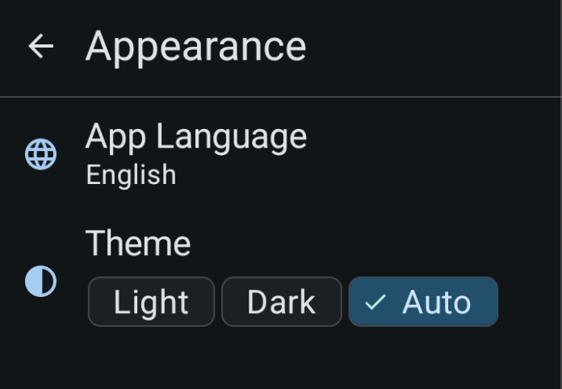

# Appearance

This is where you setup the theme and language of the app.

## Theme

You can choose between a light, dark or system theme for the app. The default is System.

## Language

You can select the language for the app's interface. The available languages are:

- English
- Japanese
- Korean
- Chinese
- Taiwanese
- Vietnamese
