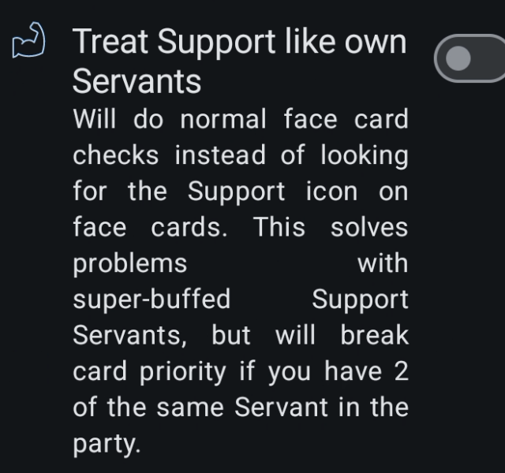
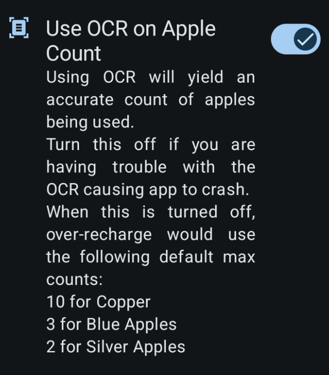

# Global Battle Settings

This is where you can configure the global battle settings for the app.

## Battle Configuration

### Game Server

The default is `Auto-detect` it will make use of the Accessibility service in order to detect the app package and therefore provide the accurate game server.

| Default | Dialog |
| --- | --- |
|  |  |

### Story Skip

This setting allows you to skip the story scenes in the game.

#### Story Skip Limitation

The feature will get stuck when a story requires user input to make a choice and cannot be skipped. We do not currently plan to address this limitation.

### Boost Item

FGO used to have items in events to boost performance of servants. Not much nowadays.

### Hide SQ in AP Resources

This will make the SQ which is a premium currency to be hidden by default for resource refill. Will prevent accidental usage.

### Treat Support like own servants

This is a setting to solve the problem with super-buffed servants.

Super-buffed servants are support servants that have received too many buffs that part of their "support" tag is hidden, making them appear as regular servants and tracking them results into unknown servant.

The "support" tag is the one the app uses to track which are support or not.

### Use OCR on Apple Count

An unoptimized Tesseract setup can spawn too many threads and cause the script to crash. This setting is included in case these crashes persist.

OCR (Optical Character Recognition) was added to more accurately read the number of Apples used in the game.

