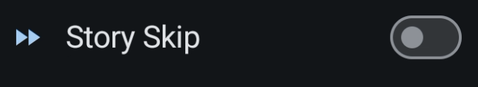

# Global Battle Settings

This is where you can configure the global battle settings for the app.

## Battle Configuration

### Game Server

The default is `Auto-detect` it will make use of the Accessibility service in order to detect the app package and therefore provide the accurate game server.

| Default | Dialog |
| --- | --- |
|  |  |

### Story Skip

This setting allows you to skip the story scenes in the game.

#### Story Skip Limitation

The feature will get stuck when a story requires user input to make a choice and cannot be skipped. We do not currently plan to address this limitation.

### Boost Item

FGO used to have items in events to boost performance of servants. Not much nowadays.

### Hide SQ in AP Resources

This will make the SQ which is a premium currency to be hidden by default for resource refill. Will prevent accidental usage.

