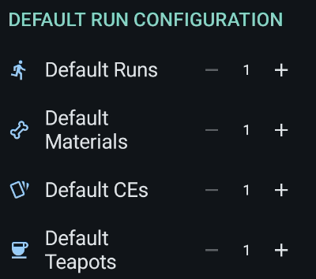
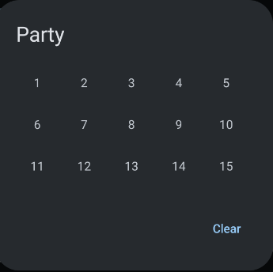

# Battle Config

Battle configs store all the settings for automated farming runs. Each config defines how FGA runs battles, selects supports, and picks command cards.

## Overview

A battle config contains:

- **Identity settings** - Name, notes, and favorite status
- **Skill commands** - The sequence of skills to use each turn
- **Default run settings** - How many runs, materials, and resources to use
- **Farming options** - Materials to track, server restrictions, and party selection
- **Command card priorities** - How to pick attack cards each turn
- **Support selection** - Which friend support to choose
- **Battle behavior** - Exit conditions, raid delays, and other options

## Key Features

### Identity Settings

Give your config a recognizable name and add notes for reference.

| Name and Notes                                         | Edit Dialog                                                          |
| ------------------------------------------------------ | -------------------------------------------------------------------- |
|  |  |

- **Name** - A unique identifier for the battle config (required)
- **Notes** - Multi-line text for additional information (text only, no images)
- **Favorite** - Mark important configs for easy access

Tap the name or notes field to open the edit dialog.

### Skill Commands

Skill commands define which skills to activate each turn and wave.

| Skill Command                                        | Quick Edit Dialog                                                  |
| ---------------------------------------------------- | ------------------------------------------------------------------ |
|  |  |

Two ways to edit skill commands:

1. **Skill Maker** - Tap the command to open the full [Skill Maker](skill-maker.md) editor
2. **Quick Edit** - Tap the terminal icon for a text-based popup dialog

### Default Run Configuration

Set the starting values for each farming session:

| Setting       | Description                                    | Range |
| ------------- | ---------------------------------------------- | ----- |
| **Runs**      | Number of battle loops to complete             | 1-300 |
| **Materials** | Stop after collecting this many materials      | 1-300 |
| **CEs**       | Stop after collecting this many Craft Essences | 1-300 |
| **Teapots**   | Number of golden apples or teapots to use      | 1-300 |

These values reset to defaults when the previous run completes its target.

!!! note "Current Limitation"
    The current values only reset after reaching their limits. Use the reset button in the Battle Launcher to manually restore default values.

### Farming Configuration

Configure what and where you want to farm:

- **Materials** - Select which materials to track. Tap to open the [Materials](materials.md) editor.
- **Server** - Restrict this config to a specific game server, or leave as "Default" for all servers.
- **Party** - Choose which party slot to use for battles.

| Setting        | Preview                                                   |
| -------------- | --------------------------------------------------------- |
| Party Selection |  |

!!! info "Party Slots by Server"
    JP and CN servers have 15 party slots. Other servers have 10 slots. If you select party 15 but play on a 10-slot server, FGA automatically uses slot 10.

### Command Card Priority

Control how FGA picks command cards each turn:

| Option                            | Effect                                              |
| --------------------------------- | --------------------------------------------------- |
| **Skip servant face-card checks** | Faster card selection but may pick weaker cards     |
| **Use Servant Priority**          | Prioritize specific servants' cards over card types |
| **Use Crit Stars Priority**       | Prefer cards with 80-100% critical chance           |

Tap the priority summary to open the [Command Card Priority](card-priority.md) editor.

### Support Selection

Choose how FGA picks a friend support servant.

| General Setup                                                        | Preferred Setup                                                           |
| -------------------------------------------------------------------- | ------------------------------------------------------------------------- |
|  |  |

#### Selection Modes

| Mode          | Behavior                                                  |
| ------------- | --------------------------------------------------------- |
| **First**     | Selects the first available support immediately           |
| **Manual**    | Pauses the script for manual selection, then resume       |
| **Preferred** | Searches for specific servants or CEs before falling back |

#### Preferred Mode Options

When using Preferred mode:

- **Fallback** - What to do if the preferred support is not found (First or Manual)
- **Servant/CE Selection** - Configure in the [Support Setup](support.md) page
- **Also Check All** - Search the "All" class tab in addition to the selected class
- **Auto Friend Request** - Send friend requests to non-friends after battle

### Script Exit Conditions

Control when FGA stops the battle script:

| Setting                  | Effect                                                    |
| ------------------------ | --------------------------------------------------------- |
| **Out of Commands Exit** | Exit battle when no more skill commands remain            |
| **Off-script Exit**      | Exit when reaching a turn or wave not covered by commands |

Enabling "Off-script Exit" also triggers an exit when commands run out.

### Raid Settings

Special options for raid battles like Tunguska or event raids:

| Setting            | Effect                                 |
| ------------------ | -------------------------------------- |
| **Raid Delay**     | Enable a delay before the first action |
| **Delay Duration** | Wait time in seconds (1-10)            |
| **Skip Intro**     | Automatically skip story introductions |

!!! tip "Why Use Raid Delay?"
    Some raid battles display kill counters that interfere with FGA's timing. Adding a delay allows the overlay to disappear before FGA starts acting.

    

### Additional Options

| Setting                | Effect                                                       |
| ---------------------- | ------------------------------------------------------------ |
| **Auto-Choose Target** | Automatically select enemies tagged as "servant" or "danger" |
| **Shuffle Cards**      | Re-deal command cards based on specified conditions          |
| **Shuffle Wave**       | Which wave to trigger card shuffling (1-3)                   |

### Config Management

Use the top bar buttons to manage your config:

- **Export** - Save the config as a JSON file to share or backup
- **Copy** - Create a duplicate of the current config
- **Delete** - Remove the config permanently

## Tips for Best Results

1. **Start simple** - Create basic configs first, then add complexity as needed
2. **Use descriptive names** - Include the quest name and farming target (e.g., "Doors - QP Farming")
3. **Test your skill commands** - Run once manually to verify timing before long farming sessions
4. **Set realistic limits** - Match run counts to your available AP and apples
5. **Use Preferred support wisely** - Set a reasonable fallback for when friends are unavailable

## Troubleshooting

### Config shows on wrong server

Set the Server option to restrict configs to specific servers, or use "Default" for all servers.

### Skill commands not executing correctly

Open the Skill Maker and verify the command sequence matches your intended rotation. Check that wave timings align with enemy counts.

### Support selection fails

- Verify servant and CE images in the [Support Setup](support.md)
- Ensure the correct class is selected
- Enable "Also Check All" to search additional tabs
- Set a fallback option for when preferred supports are unavailable

### Battle exits unexpectedly

Check exit condition settings:

- Disable "Out of Commands Exit" if you want FGA to continue with card selection
- Disable "Off-script Exit" if battles may have variable turn counts
