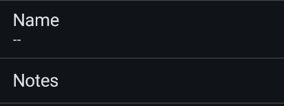
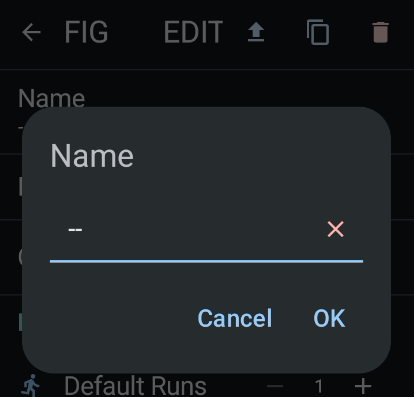
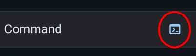
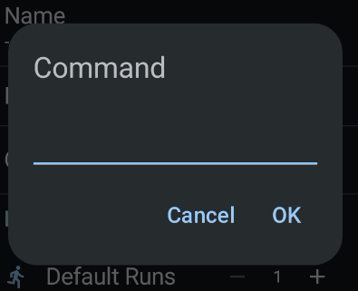

# Battle Config

This is how to setup the battle config.

## Identity

Clicking either the name or notes would popup a dialog to edit it.

| Name and notes | Name and notes dialog |
| --- | --- |
|  |  |

## Command

Clicking the command would redirect you to the [Skill Maker Screen](skill-maker.md) while clicking the `terminal` icon would show a popup dialog for quick edit

| Skill command | Skill command dialog |
| --- | --- |
|  |  |