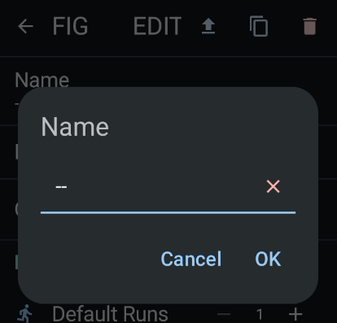
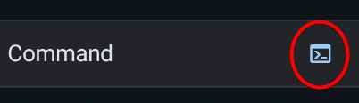
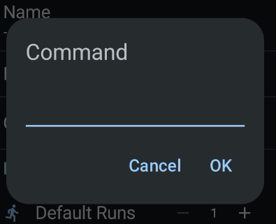
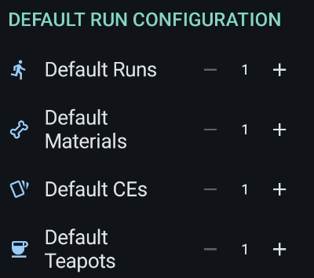

# Battle Config

This is how to setup the battle config.

## Identity

Clicking either the name or notes would popup a dialog to edit it.

| Name and notes | Name and notes dialog |
| --- | --- |
|  |  |

## Command

Clicking the command would redirect you to the [Skill Maker Screen](skill-maker.md) while clicking the `terminal` icon would show a popup dialog for quick edit

| Skill command | Skill command dialog |
| --- | --- |
|  |  |

## Default Run Configuration

When a run ended, the default run configuration values will be used for the initial values of the next run.

### Limitation

Due to current architectural limitations, we can't update the current configuration. Run/materials/CE/teapots need to reach their limits before the default values are applied.

As a workaround, we added a button in the Battle Launcher to reset the configuration to its default values.

The current migration to Datastore would hopefully resolve this issue.
