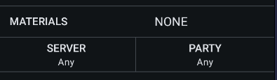
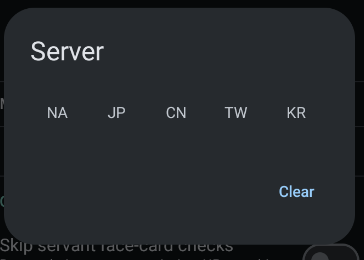
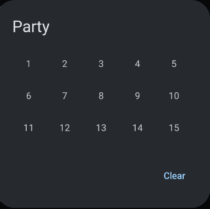
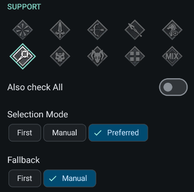
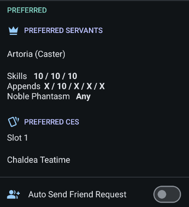

# Battle Config

This is how to setup the battle config.

## Identity

- **Name** - The name of the battle config
- **Notes** - A multi-line text field for additional information. It cannot contain images only text would be rendered.

Clicking either the name or notes would popup a dialog to edit it.

| Name and notes | Name and notes dialog |
| --- | --- |
|  |  |

## Command

Clicking the command would redirect you to the [Skill Maker Screen](skill-maker.md) while clicking the `terminal` icon would show a popup dialog for quick edit

| Skill command | Skill command dialog |
| --- | --- |
|  |  |

## Default Run Configuration

When a run ended, the default run configuration values will be used for the initial values of the next run.

### Limitation

Due to current architectural limitations, we can't update the current configuration. Run/materials/CE/teapots need to reach their limits before the default values are applied.

As a workaround, we added a button in the Battle Launcher to reset the configuration to its default values.

The current migration to Datastore would hopefully resolve this issue.

## Farming Configuration

| Server Configuration | Party Configuration |
| --- | --- |
|  |  |

## Command Card

This is the section where you'll configure the command card priority for the battle.

| Command Card Option | Command Card Option Description |
| --- | --- |
| Skip servant face-card checks | If enabled, the app will not check if the servant face card matches allowing for faster picking of cards in exchange of possibly weaker cards. |
| Use Servant Priority | If enabled, the app will prioritize the servant's cards before the command card type |
| Use Crit Stars Priority | If enabled, the app will prioritize cards with high chance to do critical damage. The default percentage is 80 ~ 100% |

Below the Command Card options is the summary of the current command card priority.

The summary is clickable and will redirect you to the [Command Card Priority](card-priority.md) page.

For more information about command cards, go to [Command Card Priority](card-priority.md)

## Support

This is where we will setup the support to be chosen.

| General Support Setup | Preferred Support Setup |
| --- | --- |
|  |  |

### General Support Setup

This is where you setup the class and what kind of support mode the app would perform.

| Selection Mode | Description |
| --- | --- |
| First | The app will always select the first available support option. |
| Manual | The app would stop the script and the user need to manually select a support option. After that, the user need to start the script again. |
| Preferred | The app will select the preferred support option based on the setup below. If no preferred support is available after certain amount of actions, it will use fallback option |

### Preferred Support Setup

This is where you precisely define the preferred support setup for the battle.

In order to learn about the preferred support visit [support](support.md) page

**Auto send Friend Request** - If enabled, the app will automatically send a friend request to the selected support option after the battle and if the borrowed servant is not already on the friend list.

## Battle Settings

| Settings | Description |
| --- | --- |
| Out of Commands Exit | When you run out of commands, the app will automatically exit the battle. |
| Off-script Exit | When a turn/wave that is not on the list of commands, the app will automatically exit the battle. If you disabled `Out of Commands Exit` but enabled this option, the app will also exit the battle as it encounters an off-script turn/wave. |
| Raid | When enabled, it will delay the initial action of the script according to the `raid delay` |
| Raid Delay | Amount of time (in seconds) to delay the initial action of the script. |
| Auto-Choose Target | If enabled, the app will automatically choose the target with first `servant` or `danger` tag. |
| Shuffle Cards | It will shuffle cards depending on the commands cards. |

Dev notes:

- Raid Delay

    The best example of this is the Tunguska Raid wherein it would display the counter of raid kills left. This messes up the timing of the script if you opt-in to not one shot for maximum rewards.

    

    On the Youtube timestamp link will show you the exact moment in the video where this is relevant.

- Auto-Choose Target - I honestly never used this
- Shuffle Cards - I also never shuffle my cards either.
