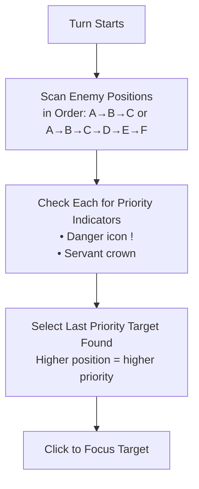

# Auto Target Enemy Selection

Automatically prioritize dangerous enemies and servant bosses during battle.

## Overview

Auto Target keeps your attacks on the most threatening enemy so you do not need to retarget every turn. It removes manual taps during Auto Battle, focusing on danger-marked mobs and servant bosses before they can wipe your team. Best for farming nodes or challenge quests with high-priority enemies.

## Key Features

- **Danger Detection**: Identifies enemies marked with the danger indicator (!)
- **Servant Detection**: Recognizes enemy servants by their crown icon
- **Formation Support**: Works with both 3-enemy and 6-enemy battle formations
- **Smart Targeting**: Picks the last priority enemy found in the scan order (typically the boss)

## How to Access

1. Open FGA and choose your **Battle Config**.
2. Scroll to the **Auto choose target** toggle and enable it.
3. Start **Auto Battle**; FGA scans at the start of each turn.
4. Optional: Add enemy targets in **Skill Command** (for example, `t3`) if you want to override Auto Target on specific turns.

## How Auto Target Works



## Enemy Formation Types

### Standard 3-Enemy Formation

The most common formation with enemies in three positions:

| Position | Code | Priority |
| -------- | ---- | -------- |
| Left     | 1    | Lower    |
| Center   | 2    | Medium   |
| Right    | 3    | Higher   |

### Extended 6-Enemy Formation

Some quests feature six enemies across two rows:

| Position     | Code | Notes                          |
| ------------ | ---- | ------------------------------ |
| Front Left   | 4    | Targetable                     |
| Front Center | 5    | Targetable                     |
| Front Right  | 6    | Targetable                     |
| Back Left    | 7    | Targetable after front cleared |
| Back Center  | 8    | Targetable after front cleared |
| Back Right   | 9    | Targetable after front cleared |

FGA uses different detection images for 6-enemy formations to ensure accurate targeting.

### Raid Formation

Special raid quests have unique target codes:

| Position    | Code    |
| ----------- | ------- |
| Raid Boss   | R       |
| Raid Minion | X, Y, Z |

## Priority Target Indicators

### Danger Indicator (!)

Enemies with the exclamation mark are about to use a powerful attack or have a special ability. Targeting them first can prevent team wipes.

### Servant Crown

Enemy servants (appearing in story quests or challenge content) are marked with a crown icon. These typically have:

- Higher HP pools
- Powerful Noble Phantasms
- Special skills and abilities

## How Targeting Order Works

In FGO boss stages, enemies are typically arranged with the strongest on the right:

```text
┌─────────┬─────────┬─────────┐
│ Enemy 1 │ Enemy 2 │ Enemy 3 │
│ (Weak)  │ (Medium)│ (Boss)  │
└─────────┴─────────┴─────────┘
```

Auto Target scans positions in order (A→B→C for 3-enemy, A→F for 6-enemy) and selects the **last** priority target found. This means:

- If Enemy 3 (position C) is a servant → Target Enemy 3
- If only Enemy 1 (position A) has danger indicator → Target Enemy 1
- If both Enemy 2 and 3 are servants → Target Enemy 3 (last in scan order)

If no danger icon or servant crown is detected, Auto Target leaves your current target unchanged.

## Tips for Best Results

1. **Enable it for priority waves**: Turn on Auto Target for boss or danger-icon waves where a priority target exists.
2. **Set a backup target in commands**: Add enemy target codes (such as `t1`, `t3`, or `tR`) in your **Skill Command** to force a specific target when detection is unclear.
3. **Wait for the UI to settle**: Let the battle UI finish loading each turn so danger and crown icons are visible before Auto Target scans.
4. **Match the formation**: Confirm the quest uses 3-enemy, 6-enemy, or raid layouts; 6-enemy fights use different detection images.
5. **Override manually anytime**: Tap another enemy if you want to switch targets mid-run—Auto Target will respect your choice until the next scan.

## Troubleshooting

| Problem                              | Solution                                                                                                                                                              |
| ------------------------------------ | --------------------------------------------------------------------------------------------------------------------------------------------------------------------- |
| Auto Target isn't selecting the boss | Ensure the enemy shows a danger (!) or servant crown; wait for the battle UI to finish loading before the turn starts; non-standard layouts may not match detection.  |
| Wrong enemy is selected              | Auto Target picks the last priority enemy in scan order; add manual enemy targets in your skill commands to override; confirm the indicator is on the intended enemy. |
| Targeting fails in 6-enemy quests    | Confirm your version supports 6-enemy detection; some events use unusual layouts; rerun after clearing any front-row enemies that block back-row targeting.           |

## Related Documentation

- [Auto Battle](../auto-battle.md) - Overall battle automation
- [Skill Maker](../../battle-setup/skill-maker.md) - Configure manual target commands
