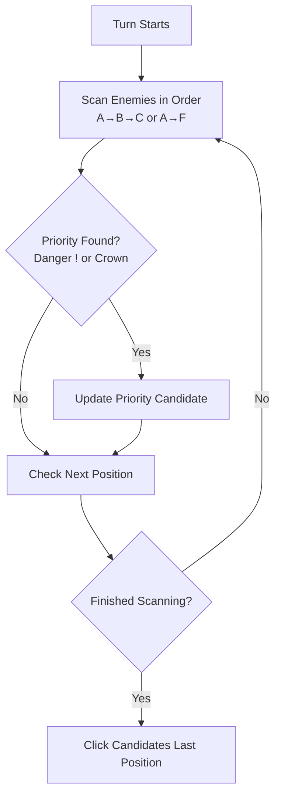

# Auto Target Enemy Selection

Automatically prioritize dangerous enemies and servant bosses during battle.

## Overview

**Auto Target** scans the battlefield at the start of each turn to identify high-priority enemies. It automatically switches your target to enemies marked with a Danger icon or Servant crown, helping to prevent team wipes from enemy Noble Phantasms or critical attacks. This feature is essential for automating harder content where ignoring priority targets can lead to defeat.

## Key Features

- **Danger Detection**: Prioritizes enemies about to use special attacks (marked with `!`).
- **Servant Recognition**: Identifies and targets enemy Servants (marked with a crown).
- **Formation Support**: Fully compatible with standard 3-enemy and extended 6-enemy quests.
- **Smart Prioritization**: Automatically selects the most dangerous enemy (typically the boss) based on screen position.

## How to Start

1. Open FGA and navigate to your **Battle Config**.
2. Scroll down to the **Auto choose target** setting.
3. Toggle the switch to **ON**.
4. Start your battle script as usual (`Auto Battle`).

   FGA will now check for targets at the beginning of every turn.

## How Auto Target Works

FGA detects targets using image recognition before executing your skills.

### Targeting Order Logic

FGA scans enemies from **Left to Right**. It selects the **last** priority enemy found. In FGO, the strongest enemy (Boss) is typically positioned on the far right, so this logic ensures the Boss is targeted over weaker mobs that might also have danger markers.

## Enemy Formation Types

FGA supports two main formation types for auto-targeting.

### Standard 3-Enemy Formation

The most common layout found in farming nodes and story quests.

| Position | Code | Priority |
| :--- | :--- | :--- |
| **Left** | `1` | Low |
| **Center** | `2` | Medium |
| **Right** | `3` | **High** (Default Boss slot) |

### Extended 6-Enemy Formation

Used in specific events or story chapters with front and back rows. FGA uses a separate set of images to detect these enemies correctly.

| Position | Code | Notes |
| :--- | :--- | :--- |
| **Front Left** | `4` | Targetable |
| **Front Center** | `5` | Targetable |
| **Front Right** | `6` | Targetable |
| **Back Left** | `7` | Targetable if visible |
| **Back Center** | `8` | Targetable if visible |
| **Back Right** | `9` | Targetable if visible |

!!! warning "Raid Battles Not Supported"
    **Auto Target** does not currently support generic Raid bosses (Code `R`) or Raid minions (Codes `X`, `Y`, `Z`). For Raid battles, use manual target commands in your specific battle script (e.g., `tR`) instead of relying on Auto Target.

## Priority Target Indicators

Auto Target looks for specific visual cues on the enemy health bars.

### Danger Indicator (!)

Enemies displaying a **Danger** icon (exclamation mark) usually have full charge bars or special threat mechanics. Targeting them prevents them from unleashing their NP on your party.

### Servant Crown

Enemy Servants are marked with a silver or gold **class icon** or **crown**. FGA treats these as high-priority targets because they typically have higher HP and more dangerous skills than regular mobs.

## Tips for Best Results

1. **Enable for Challenge Quests**: Use Auto Target for difficult content where focusing down the boss or dangerous mobs is critical for survival.
2. **Combine with Manual Overrides**: You can still use manual target commands (like `t3`) in your **Skill Command**. Manual commands in specific turns will take precedence over Auto Target for that turn.
3. **Wait for UI Stabilization**: Ensure your **Wait Time** settings allow the battle UI to fully load. FGA needs to see the Danger/Crown icons clearly to detect them.
4. **Disable for Farming Weak Mobs**: If you are farming easy waves where turn order matters more than threat (e.g., you want to hit the middle enemy first), disable Auto Target to maintain predictable targeting.

## Troubleshooting

| Problem | Solution |
| :--- | :--- |
| **Boss is not selected** | Ensure the enemy actually has a Danger icon or Crown. If the UI loads too slowly, increase **Wait Time**. Verify you are not in a Raid battle (which is unsupported). |
| **Wrong enemy targeted** | Auto Target picks the *last* priority enemy (rightmost). If multiple dangerous enemies exist, the rightmost one wins. Use manual `t` commands to override if needed. |
| **Fails in 6-enemy battles** | Ensure you are using the latest FGA version with updated 6-enemy assets. Occasionally, unique event layouts may not match the standard 6-enemy templates. |

## Related Documentation

- [Auto Battle](../auto-battle.md) - Learn about the main battle loop.
- [Skill Maker](../../battle-setup/skill-maker.md) - Configure manual target commands and skill scripts.
