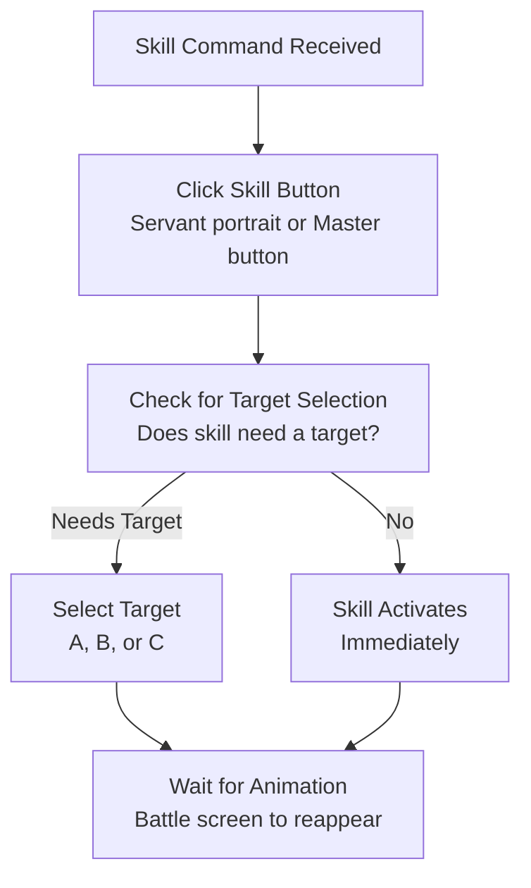
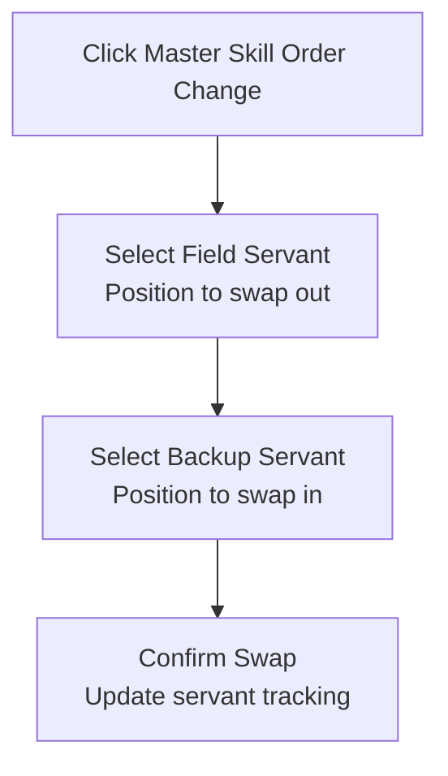

# Skill Execution During Battle

Automatic casting of servant skills, master skills, and command spells.

## Overview

FGA executes your configured skill commands during battle, handling all the taps needed to activate skills, select targets, and wait for animations. It keeps rotations consistent for farming and challenge quests, covering servant skills, Mystic Code skills, and emergency Command Spells.

## Key Features

- **Servant Skills**: Cast skills from your three field servants
- **Master Skills**: Use Mystic Code abilities
- **Command Spells**: Emergency revival and buffs
- **Target Selection**: Automatically select skill targets
- **Order Change**: Swap servants mid-battle
- **Animation Handling**: Wait for skill effects to complete

## How to Start

1. Open your **Battle Config** and set up a **Skill Command** using **Skill Maker** or by pasting a command string.
2. Save the config and go to your quest or support screen.
3. Start **Auto Battle**; FGA follows your skill commands wave by wave, including targets and Order Change steps.

## Skill Types

### Servant Skills

Each servant has three skills (S1, S2, S3):

| Skill Position    | Command |
| ----------------- | ------- |
| Servant A Skill 1 | `a`     |
| Servant A Skill 2 | `b`     |
| Servant A Skill 3 | `c`     |
| Servant B Skill 1 | `d`     |
| Servant B Skill 2 | `e`     |
| Servant B Skill 3 | `f`     |
| Servant C Skill 1 | `g`     |
| Servant C Skill 2 | `h`     |
| Servant C Skill 3 | `i`     |

### Master Skills

Your Mystic Code provides three skills:

| Skill Position | Command |
| -------------- | ------- |
| Master Skill 1 | `j`     |
| Master Skill 2 | `k`     |
| Master Skill 3 | `l`     |

### Noble Phantasms (NPs)

To cast a Noble Phantasm:

| Servant Position | Command |
| ---------------- | ------- |
| Servant A NP     | `4`     |
| Servant B NP     | `5`     |
| Servant C NP     | `6`     |

!!! tip "Mixing Skills and NPs"
    You can freely mix skills and NPs in your command chain. For example, `a 4` uses Servant A's Skill 1, then casts their NP.

### Command Spells

For emergencies (limited uses):

| Command | Effect                     |
| ------- | -------------------------- |
| `o`     | Full NP (100% gauge)       |
| `p`     | Full HP (restore one party's HP) |

## Skill Execution Flow



## Target Selection

### Ally Targets

For skills that target allies:

| Target | Position       | Command |
| ------ | -------------- | ------- |
| **1**  | Left servant   | `1`     |
| **2**  | Center servant | `2`     |
| **3**  | Right servant  | `3`     |

Example: `a1` = Servant A's Skill 1 targeting Servant A (left position).

### Enemy Targets

To switch the attack focus to a specific enemy **before** using a skill or attacking:

| Target | Position     | Command |
| ------ | ------------ | ------- |
| **1**  | Left enemy   | `t1`    |
| **2**  | Center enemy | `t2`    |
| **3**  | Right enemy  | `t3`    |

Example: `t2 a` = Target center enemy, then use Servant A's skill.

### Multi-Target Skills

Some skills allow multiple targets. Wrap the targets in parentheses `( )`.

```text
Example: Skill with 2 targets
Command: b([Ch2B]2)

1. Uses Servant A Skill 2 (b)
2. First target: 2 Choices and select B option ([Ch2B])
3. Second target: Servant B (2)
```

## Action Modifiers

Control how the turn plays out:

| Command | Effect |
| ------- | ------ |
| `n1`    | Use 1 card before NP (needs NP selected) |
| `n2`    | Use 2 cards before NP |
| `0`     | No operation (do nothing this turn) |

## Special Skill Options

For servants with choice-based skills (e.g., Space Ishtar, Emiya) or transformations (Mélusine):

| Command  | Effect |
| -------- | ------ |
| `[Ch2A]` | Option A (2-choice skill) |
| `[Ch2B]` | Option B (2-choice skill) |
| `[Ch3A]` | Option A (3-choice skill) |
| `[Ch3B]` | Option B (3-choice skill) |
| `[Ch3C]` | Option C (3-choice skill) |
| `[Tfrm]` | Transformation skill (e.g., Mélusine) |

## Order Change (Servant Swap)

Swap a field servant with a backup using the `x` command followed by the **starting** position and then the **sub** position.

### Command Format

```text
x[starting][sub]

starting: Field servant position (1=A, 2=B, 3=C)
sub: Backup servant position (1-3)

Example: x23 = Swap field servant B (position 2) with backup servant 3
```

### Swap Process



## Animation Waiting

After skill activation:

1. FGA waits for the battle screen to disappear.
2. The skill animation plays.
3. FGA waits for the battle screen to return.
4. It continues with the next command.

!!! info "Timeout Handling"
    Default wait is 5 seconds. If the screen doesn't return (e.g., lag), FGA may retry to prevent soft-locks.

## Tips for Best Results

1. **Test commands in short runs**: Verify timing and targeting before long farming sessions.
2. **Pad for slow animations**: Some skills take longer; extend waits if devices lag.
3. **Check cooldowns first**: Ensure skills are available when the command triggers.
4. **Order skills intentionally**: Commands execute in sequence; place buffs before damage.
5. **Confirm target numbers**: Use `1/2/3` for allies and `1/2/3` for enemies; mismatches cause misfires.

## Troubleshooting

| Problem                        | Solution |
| ------------------------------ | -------- |
| **Skill not being cast**       | Check cooldowns and NP/resources; confirm the command code matches `a–i` or `j–l`. |
| **Wrong target selected**      | Use `1/2/3` for ally targets. Verify servant positions if you used Order Change. |
| **Animation timeout**          | Increase wait time for slower devices. Ensure network stability. |
| **Skill confirmation missing** | FGA auto-confirms most dialogs. If it fails, capture a screenshot for support. |
| **Order Change fails**         | Confirm backup slot exists and is alive. Use `x` followed by field pos (1-3) and sub pos (1-3). |

## Related Documentation

- [Skill Maker](../../battle-setup/skill-maker.md) - Create skill commands visually
- [Auto Battle](../auto-battle.md) - Overall battle automation
- [Servant Tracking](../tracking/servant-tracking.md) - How FGA tracks servant positions
