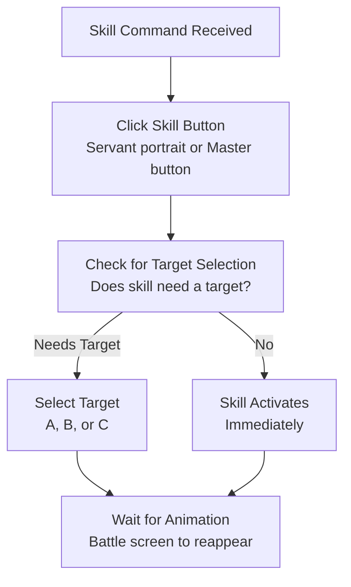
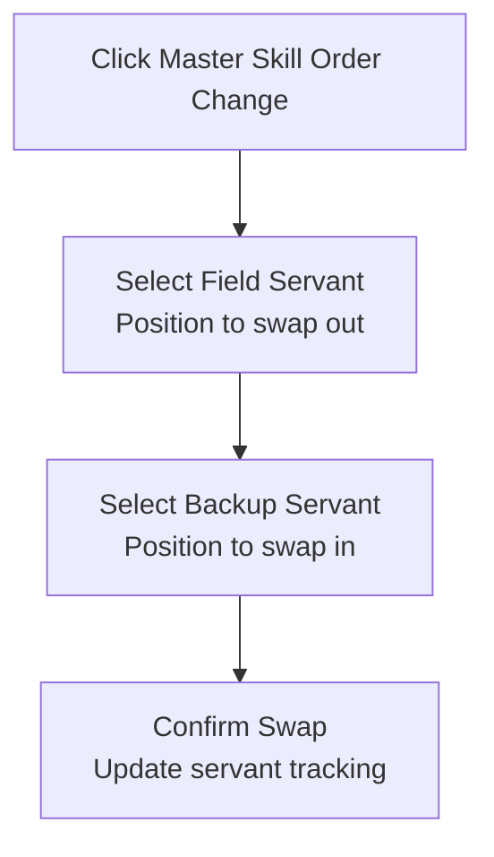

# Skill Execution During Battle

Automatic casting of servant skills, master skills, and command spells.

## Overview

FGA executes your configured skill commands during battle, handling all the taps needed to activate skills, select targets, and wait for animations. It keeps rotations consistent for farming and challenge quests, covering servant skills, Mystic Code skills, and emergency Command Spells.

## Key Features

- **Servant Skills**: Cast skills from your three field servants
- **Master Skills**: Use Mystic Code abilities
- **Command Spells**: Emergency revival and buffs
- **Target Selection**: Automatically select skill targets
- **Order Change**: Swap servants mid-battle
- **Animation Handling**: Wait for skill effects to complete

## How to Start

1. Open your **Battle Config** and set up a **Skill Command** using **Skill Maker** or by pasting a command string.
2. Save the config and go to your quest or support screen.
3. Start **Auto Battle**; FGA follows your skill commands wave by wave, including targets and Order Change steps.

## Skill Types

### Servant Skills

Each servant has three skills (S1, S2, S3):

| Skill Position    | Command |
| ----------------- | ------- |
| Servant A Skill 1 | a       |
| Servant A Skill 2 | b       |
| Servant A Skill 3 | c       |
| Servant B Skill 1 | d       |
| Servant B Skill 2 | e       |
| Servant B Skill 3 | f       |
| Servant C Skill 1 | g       |
| Servant C Skill 2 | h       |
| Servant C Skill 3 | i       |

### Master Skills

Your Mystic Code provides three skills:

| Skill Position | Command |
| -------------- | ------- |
| Master Skill 1 | j       |
| Master Skill 2 | k       |
| Master Skill 3 | l       |

### Command Spells

For emergencies (limited uses):

| Command | Effect                     |
| ------- | -------------------------- |
| o       | Full NP (100% gauge)       |
| p       | Full HP (restore party HP) |

## Skill Execution Flow



## Target Selection

### Ally Targets

For skills that target allies:

| Target | Position       | Command |
| ------ | -------------- | ------- |
| 1      | Left servant   | 1       |
| 2      | Center servant | 2       |
| 3      | Right servant  | 3       |

Example: `a1` = Servant A's Skill 1 targeting Servant A (left position)

### Enemy Targets

For skills that target enemies:

| Target | Position     |
| ------ | ------------ |
| 1      | Left enemy   |
| 2      | Center enemy |
| 3      | Right enemy  |

### Multi-Target Skills

Some skills allow multiple targets:

```text
Example: Skill with 2 targets
Command: b12

First target: Servant A (position 1)
Second target: Servant B (position 2)
```

## Order Change (Servant Swap)

Swap a field servant with a backup:

### Command Format

```text
x[starting][sub]

starting: Field servant position (1=A, 2=B, 3=C)
sub: Backup servant position (1-3)

Example: x23 = Swap field servant B (position 2) with backup servant 3
```

### Swap Process



## Skill Confirmation Dialog

Some skills show a confirmation dialog:

```text
┌─────────────────────────────────────────┐
│    Use this skill?                      │
│                                         │
│    [ Cancel ]    [ OK ]                 │
└─────────────────────────────────────────┘
```

FGA handles these automatically:

- Detects confirmation dialog
- Clicks OK to confirm
- Continues with next action

## Animation Waiting

After skill activation:

1. FGA waits for battle screen to disappear
2. Skill animation plays
3. FGA waits for battle screen to return
4. Continues with next command

### Timeout Handling

- Default wait: 5 seconds
- If screen doesn't return, may retry
- Prevents soft-locks from slow animations

## Using Command Spells

### Opening the Menu

```text
┌─────────────────────────────────────────┐
│    Click Command Spell icon             │
└─────────────────────┬───────────────────┘
                      │
                      ▼
┌─────────────────────────────────────────┐
│    Wait for menu to open                │
│    Verify Cancel button visible         │
└─────────────────────┬───────────────────┘
                      │
                      ▼
┌─────────────────────────────────────────┐
│    Select specific spell                │
│    Handle targets if needed             │
└─────────────────────────────────────────┘
```

### Available Spells

| Command | Effect                        |
| ------- | ----------------------------- |
| o       | Full NP - 100% NP for servant |
| p       | Full HP - Restore party HP    |

## Special Skill Handling

### Transform Skills (Mélusine)

When a servant transforms:

1. FGA detects transformation
2. Updates servant tracking
3. Recaptures new skill icons
4. Continues normally

### Skills with Multiple Effects

Some skills have multiple phases:

1. First effect activates
2. May need second target selection
3. FGA handles each phase

## Common Skill Command Patterns

### Standard Buff Setup

```text
Wave 1: a, d, g
(All servants use Skill 1: A=a, B=d, C=g)
```

### Boss Wave Setup

```text
Wave 3: j1, a, b, c, e1
(Master skill 1 targets servant A, Servant A uses all skills, Servant B skill 2 targets A)
```

### Order Change Pattern

```text
Wave 1: a, b, x13, ...
(Servant A uses skills 1 and 2, then swaps with backup servant 3)
```

## Tips for Best Results

1. **Test commands in short runs**: Verify timing and targeting before long farming sessions.
2. **Pad for slow animations**: Some skills take longer; extend waits if devices lag.
3. **Check cooldowns first**: Ensure skills are available when the command triggers.
4. **Order skills intentionally**: Commands execute in sequence; place buffs before damage.
5. **Confirm target numbers**: Use `1/2/3` for allies and `1/2/3` for enemies; mismatches cause misfires.

## Troubleshooting

| Problem                        | Solution                                                                                                                                           |
| ------------------------------ | -------------------------------------------------------------------------------------------------------------------------------------------------- |
| Skill not being cast           | Check cooldowns and NP/resources; confirm the command code matches `a–i` or `j–l`; ensure the step is placed in the correct wave.                  |
| Wrong target selected          | Use `1/2/3` for ally targets and `1/2/3` for enemy targets; verify servant positions after Order Change; adjust commands if a servant was swapped. |
| Animation timeout              | Increase wait time for slower devices or long animations; ensure network stability; rerun after adjusting delays.                                  |
| Skill confirmation not handled | FGA auto-confirms most dialogs; unusual layouts may fail—retry and capture a screenshot for support.                                               |
| Order Change fails             | Confirm backup slot exists and the servant is alive; use `x[starting][sub]` with positions 1-3; open Master skills before issuing the swap.        |

## Related Documentation

- [Skill Maker](../../battle-setup/skill-maker.md) - Create skill commands
- [Auto Battle](../auto-battle.md) - Overall battle automation
- [Servant Tracking](../tracking/servant-tracking.md) - Position tracking
