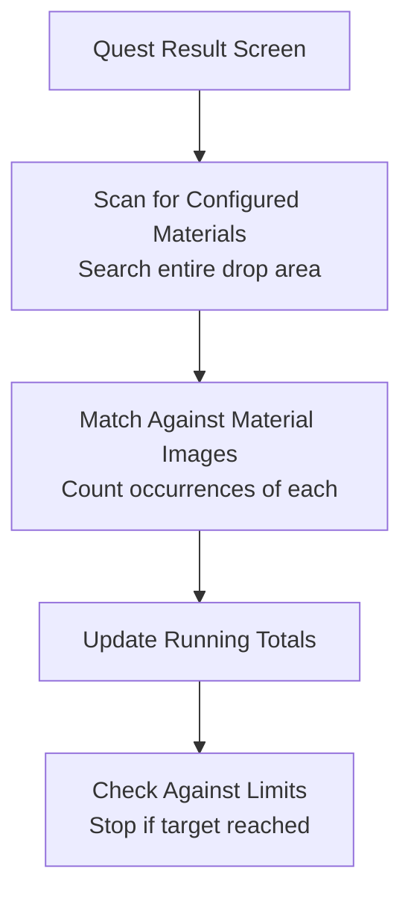

# Materials and Drop Tracking

Monitor and track material drops during your farming sessions.

## Overview

FGA can track specific materials that drop during quests, keeping count of how many you've collected. Set target amounts to automatically stop farming when you've gathered enough, or simply monitor your progress without limits.

## Key Features

- **Material Detection**: Identifies configured materials in drop screens
- **Count Accumulation**: Tracks totals across multiple runs
- **Limit Enforcement**: Stop when target amount is reached
- **Auto-Decrement**: Reduce remaining limit after session ends
- **Multi-Material Support**: Track multiple materials simultaneously

## How Material Tracking Works



## Configuration

### Selecting Materials

1. Open your Battle Config
2. Navigate to Materials section
3. Select materials from the list
4. Choose materials that drop in your target quest

### Material Categories

| Category         | Examples                       |
| ---------------- | ------------------------------ |
| Gems             | Saber gems, Caster gems, etc.  |
| Pieces/Monuments | Saber pieces, Lancer monuments |
| Bronze Materials | Bones, Dust, Fangs             |
| Silver Materials | Seeds, Feathers, Stakes        |
| Gold Materials   | Hearts, Scales, Lores          |
| Event Materials  | Event-specific drops           |

### Setting Limits

| Setting          | Behavior                |
| ---------------- | ----------------------- |
| Disabled         | Track without stopping  |
| Enabled + Amount | Stop when total reached |

## Material Detection

### How Detection Works

1. FGA loads images for your selected materials
2. On the drop screen, it scans the entire visible area
3. Pattern matching identifies each material instance
4. Counts are accumulated per material type

### Detection Accuracy

| Factor            | Impact                               |
| ----------------- | ------------------------------------ |
| Image quality     | Higher quality = better detection    |
| Screen resolution | Affects pattern matching             |
| Material stacking | Multiple drops detected individually |

## Tracking Multiple Materials

Track several materials at once:

```text
Configured Materials:
- Dragon Fangs
- Void Dust
- Hero's Proof

After 5 Runs:
┌─────────────────────────────────────────┐
│         Materials Farmed                │
├─────────────────────────────────────────┤
│ Dragon Fangs: 12                        │
│ Void Dust: 8                            │
│ Hero's Proof: 15                        │
└─────────────────────────────────────────┘
```

## Limit Behavior

### Stop on Limit

When limit is enabled and reached:

1. Current run completes normally
2. Run is counted in statistics
3. Script stops with "Limit Materials" reason
4. Exit summary shows final counts

### Auto-Decrement

After script completion:

```text
Before Run:
- Material Limit: 50

During Run:
- Materials Collected: 15

After Run:
- Material Limit: 35 (auto-decremented)
```

When limit reaches 0:

- Material limiting is disabled
- Limit resets to default value
- Tracking continues without stopping

## Exit Summary

After script completion, view material statistics:

```text
┌─────────────────────────────────────────┐
│         Battle Exit Summary             │
├─────────────────────────────────────────┤
│ Materials:                              │
│   Dragon Fangs: 23                      │
│   Void Dust: 18                         │
│   Hero's Proof: 31                      │
│ ...                                     │
└─────────────────────────────────────────┘
```

## Tips for Best Results

1. **Select only relevant materials**: More materials = more processing time
2. **Know your quest drops**: Only track materials that actually drop
3. **Set realistic limits**: Based on drop rates and available AP
4. **Check drops manually first**: Verify material detection works
5. **Use with screenshots**: Enable drop screenshots for records

## Material Drop Rates

Plan your limits based on typical drop rates:

| Drop Type        | Typical Rate           |
| ---------------- | ---------------------- |
| Bronze materials | Common (2-3 per run)   |
| Silver materials | Uncommon (0-2 per run) |
| Gold materials   | Rare (0-1 per run)     |
| Gems             | Variable by quest      |

## Best Farming Locations

Configure materials for optimal farming:

### Free Quests

- Consistent drops
- Known material pools
- Can use material tracking effectively

### Event Quests

- Event materials often trackable
- Bonus drops with CEs/teapots
- May have mixed drop pools

### Daily Quests

- Gem and monument farming
- Predictable material types
- Good for limit-based farming

## Troubleshooting

### Materials not being detected

- Verify material is selected in config
- Check if material actually drops in quest
- Ensure drop screen is fully visible
- Update FGA for latest material images

### Count seems inaccurate

- Multiple of same material may stack
- Visual stacking affects detection
- Compare with actual inventory after run

### Script not stopping at limit

- Check if limit is properly enabled
- Verify limit amount is greater than 0
- Sum of all materials must reach limit

### Wrong materials being counted

- Material images may be similar
- Check which materials are configured
- Remove similar-looking materials

### Auto-decrement not working

- Only triggers on successful completion
- Manual stops may not decrement
- Check limit settings after run

## CE Drop Tracking

Craft Essence drops are tracked separately:

| Feature      | Materials         | CE Drops        |
| ------------ | ----------------- | --------------- |
| Detection    | Material images   | CE icon + stars |
| Counting     | Per material type | Total CEs       |
| Limits       | Combined total    | Separate limit  |
| Notification | Exit summary      | Immediate alert |

See [CE Drop Tracking](ce-drops.md) for dedicated CE tracking.

## Related Documentation

- [Auto Battle](../auto-battle.md) - Overall battle automation
- [CE Drop Tracking](ce-drops.md) - Track Craft Essence drops
- [Run Limits](../../app/advanced.md) - Configure limits
