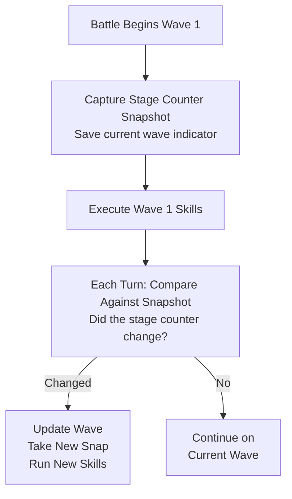

# Stage and Wave Tracking

Detect wave changes to execute the correct skills for each battle stage.

## Overview

FGA tracks which wave (stage) you're on during battle to execute the appropriate skill commands. Different waves often require different strategies, and accurate wave detection ensures your configured skills activate at the right time.

## Key Features

- **Wave Detection**: Identifies current battle wave
- **Change Detection**: Knows when you've moved to next wave
- **Command Triggering**: Activates wave-specific skills
- **Snapshot Comparison**: Uses image matching for accuracy
- **Threshold Processing**: Filters background for reliable detection

## How Stage Tracking Works



## Stage Counter Location

The stage indicator appears in the game UI:

```text
┌─────────────────────────────────────────┐
│  Battle                                 │
│                      Stage 2/3  ← Here  │
│                                         │
│  [Enemy] [Enemy] [Enemy]                │
│                                         │
└─────────────────────────────────────────┘
```

FGA monitors this region for changes.

## Detection Method

### Snapshot Approach

1. **Capture**: Take screenshot of stage counter area
2. **Store**: Save as reference for current wave
3. **Compare**: Each turn, compare current screen to snapshot
4. **Detect**: If different, wave has changed

### Image Thresholding

FGA applies thresholding to improve detection:

```text
Original Image:
┌─────────────────┐
│ Stage 1/3      │  (with background)
└─────────────────┘

After Threshold:
┌─────────────────┐
│ Stage 1/3      │  (white text, black background)
└─────────────────┘
```

This removes background variations that could cause false detections.

## Wave Numbers

### Standard Quests

Most quests have 3 waves:

| Wave | Typical Content     |
| ---- | ------------------- |
| 1    | Weak enemies        |
| 2    | Medium enemies      |
| 3    | Boss/strong enemies |

### Variable Wave Counts

Some quests may have:

- 1 wave (boss rush)
- 2 waves (shorter quests)
- 4+ waves (challenge/special)

FGA handles any wave count automatically.

## Skill Command Timing

### Wave-Specific Commands

Configure different skills for each wave:

```text
Wave 1: a1, b2, c3, np
Wave 2: a1, np
Wave 3: master1, a1, a2, a3, np
```

FGA executes the appropriate commands when each wave begins.

### Turn Tracking Within Waves

FGA also tracks turns within each wave:

```text
Wave 2, Turn 1: Use buffs
Wave 2, Turn 2: Use NP
Wave 2, Turn 3: (if needed) additional skills
```

## Detection Accuracy

### Similarity Threshold

FGA uses a similarity score to detect changes:

| Scenario        | Action               |
| --------------- | -------------------- |
| High similarity | Same wave, continue  |
| Low similarity  | Wave changed, update |

### Threshold Value

A threshold of ~0.67 is used to:

- Filter background noise
- Isolate the stage counter text
- Improve matching accuracy

## New vs Legacy Detection

### New Stage Counter Detection

- Uses image thresholding
- More accurate across servers
- Handles background variations

### Legacy Detection

- Direct image comparison
- May be affected by backgrounds
- Fallback for compatibility

Configure in advanced settings.

## Tips for Best Results

1. **Configure all waves**: Set skills for each expected wave
2. **Test detection first**: Run one battle to verify wave changes detected
3. **Check server differences**: Stage counter fonts may vary
4. **Use appropriate timing**: Skills should account for wave transitions
5. **Monitor turn counts**: Ensure turns are tracked correctly

## Wave Change Events

When a wave change is detected:

1. State updated to new wave number
2. Turn counter resets to 0
3. New stage snapshot captured
4. Wave-specific skills queued
5. Servant tracking refreshed

## Troubleshooting

### Wave changes not detected

- Check if stage counter is visible
- Verify screen region is correct
- Try enabling new stage counter detection
- Check similarity threshold settings

### Skills executing on wrong wave

- Verify skill command wave configuration
- Check if detection timing is correct
- Ensure wave numbers match expectations

### False wave change detection

- Background may be interfering
- Enable thresholding for cleaner detection
- Check if animations are affecting screen

### Stage counter not visible

- Some quests hide the counter
- Check if using a modified UI
- Verify game version compatibility

### Turn count seems wrong

- Turns reset on wave change
- Multi-turn waves count correctly
- Check command configuration

## Server Differences

Stage counter fonts may differ by server:

| Server | Font Style        | Notes                  |
| ------ | ----------------- | ---------------------- |
| JP     | Japanese numerals | May use different font |
| NA/EN  | English numerals  | Standard detection     |
| Others | Variable          | Check compatibility    |

## Advanced Settings

### New Stage Counter

When enabled:

- Uses threshold filtering
- Better background removal
- Recommended for most users

### Legacy Mode

When disabled:

- Direct comparison method
- May work better on some devices
- Fallback option

## Related Documentation

- [Auto Battle](../auto-battle.md) - Overall battle automation
- [Skill Maker](../../battle-setup/skill-maker.md) - Configure wave skills
