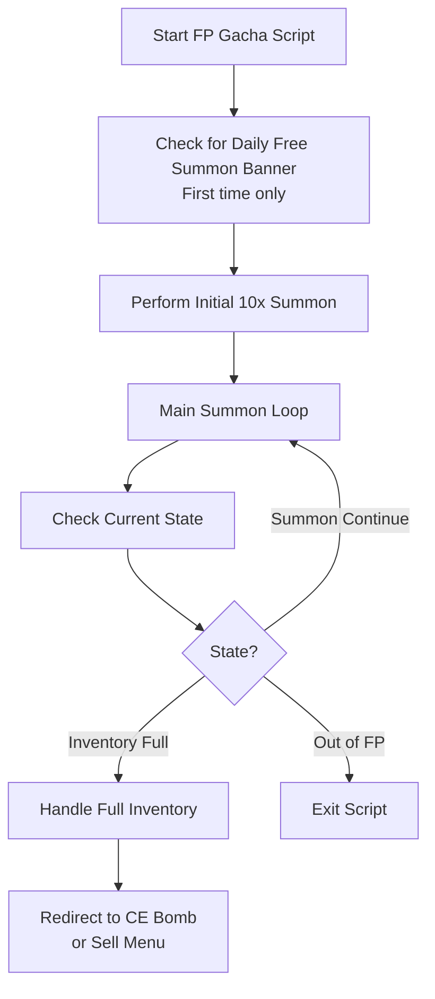

# Friend Point Gacha

Automatically performs Friend Point (FP) summons in the Friend Point gacha screen.

## Overview

The Friend Point Gacha script continuously triggers 100x summons using Friend Points. It handles inventory management and can redirect to selling or CE enhancement when the inventory becomes full.

## How to Start

1. Navigate to the **Friend Point Summon** screen in the game
2. The script will automatically detect the FP summon screen when you see:
   - The "Friend Summon" banner on the initial summon screen
   - The continue summon button after your first summon

## Workflow

## Key Features

### Summon Limit

- **Optional FP limit**: Set a maximum number of summons to perform
- Once the limit is reached, the script can either stop or redirect to the sell menu

### Inventory Full Handling

When the inventory becomes full, the script can:

1. **Redirect to CE Enhancement** - Create CE bombs with the summoned CEs
2. **Redirect to Sell Menu** - Sell unwanted cards
3. **Stop the script** - Exit with an inventory full notification

### Connection Retry

- Automatically handles connection issues
- Retries when network errors occur

## Settings

| Setting          | Description                                                |
| ---------------- | ---------------------------------------------------------- |
| Limit FP         | Enable/disable summon limit                                |
| FP Limit Count   | Maximum number of summons before stopping                  |
| Redirect to Sell | Navigate to sell menu when limit reached or inventory full |
| Create CE Bomb   | Redirect to CE enhancement when inventory is full          |

## Exit Reasons

The script will stop and notify you when any of these conditions occur:

| Exit Reason                              | Description                                               |
| ---------------------------------------- | --------------------------------------------------------- |
| **Inventory Full**                       | Your inventory is full and no redirect option is enabled  |
| **Run Out of Friend Points**             | No more Friend Points available for summoning             |
| **Summon Limit Reached**                 | The configured summon limit has been reached              |
| **Reached Sell Banner**                  | Successfully navigated to the sell menu                   |
| **Unable to Verify CE Enhancement Menu** | Failed to navigate to CE enhancement after inventory full |
| **Sell Banner Not Visible**              | Expected to see sell menu but could not detect it         |

## Tips for Best Results

1. **Clear inventory space** before starting for longer runs
2. **Enable redirect options** to maximize summoning efficiency
3. **Set appropriate limits** if you want controlled summon sessions
4. **Ensure stable connection** for uninterrupted summoning
