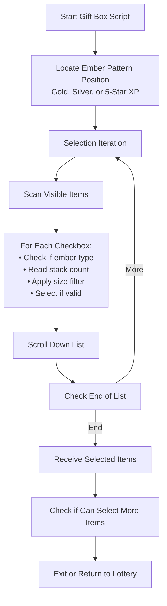

# Auto Gift Box (Present Box)

Automatically collects embers from the gift box (present box) with intelligent filtering.

## Overview

The Gift Box script automatically selects and collects gold embers from your present box. It uses OCR to read stack sizes and filter based on your preferences, ensuring you only collect what you need.

## How to Start

1. Navigate to the **Present Box** screen in the game
2. The script will automatically detect the gift box screen when:
   - Gold XP cards (embers) are visible in the list
   - Silver XP cards are visible
   - 5-star gold XP cards are visible
3. Make sure the gift box has items to collect

## Workflow



## Key Features

### Intelligent Ember Detection

- Identifies gold 4-star embers
- Identifies silver 3-star embers  
- Identifies gold 5-star embers
- Uses OCR to read stack sizes (e.g., "x50")

### Stack Size Filtering

- Only selects stacks within your configured maximum size
- Prevents selecting large stacks you want to keep

### Gold Ember Counting

- Tracks total gold embers selected
- Stops when reaching your configured limit

### Server-Specific Adjustments

- Adjusts detection regions based on game server
- Supports JP, EN, KR, TW, and CN servers

## Settings

| Setting                             | Description                                                   |
| ----------------------------------- | ------------------------------------------------------------- |
| Max Gold Ember Stack Size           | Maximum stack size to select (larger stacks skipped)          |
| Max Gold Ember Total Count          | Maximum total gold embers to collect                          |
| Loop Into Lottery After Present Box | Return to lottery after collection (when called from lottery) |


## Exit Reasons

The script will stop and notify you when any of these conditions occur:

| Exit Reason                | Description                                                   |
| -------------------------- | ------------------------------------------------------------- |
| **No Embers Found**        | Could not locate any embers in the gift box                   |
| **Cannot Select Any More** | Reached selection limit or no more valid items                |
| **Return to Lottery**      | Successfully collected embers and returning to lottery script |

## Selection Algorithm

For each item in the gift box:

```text
┌─────────────────────────────────────────┐
│     Is Item Checkbox Visible?           │
└─────────────────────┬───────────────────┘
                      │ Yes
                      ▼
┌─────────────────────────────────────────┐
│   Check Icon Region for Ember Type      │
│   • Gold 4★ XP?                         │
│   • Silver 3★ XP?                       │
│   • Gold 5★ XP?                         │
└─────────────────────┬───────────────────┘
                      │ Ember Found
                      ▼
┌─────────────────────────────────────────┐
│   Read Stack Count Using OCR            │
│   (Extract number from "x50" etc.)      │
└─────────────────────┬───────────────────┘
                      │
                      ▼
┌─────────────────────────────────────────┐
│   Is Stack Size ≤ Max Stack Size?       │
└─────────────────────┬───────────────────┘
                      │ Yes
                      ▼
┌─────────────────────────────────────────┐
│   Select Item and Add to Count          │
└─────────────────────────────────────────┘
```

## Usage with Lottery

When the lottery script detects a full present box, it can automatically invoke the Gift Box script:

1. **Lottery detects present box full**
2. **Navigates to gift box**
3. **Gift Box script collects embers**
4. **Returns to lottery** (if enabled)
5. **Continues spinning**

## Tips for Best Results

1. **Set appropriate stack size limits** to skip large stacks you want to keep
2. **Configure gold ember limits** to avoid excessive collection
3. **Clear non-ember items manually** if they're blocking embers
4. **Ensure embers are visible** at the start of the gift box list

## Technical Notes

- Maximum 99 items can be selected per batch
- Uses 3 consecutive null checks to detect end of list
- Scrolls through the list to find all valid items
- Handles connection retries automatically
