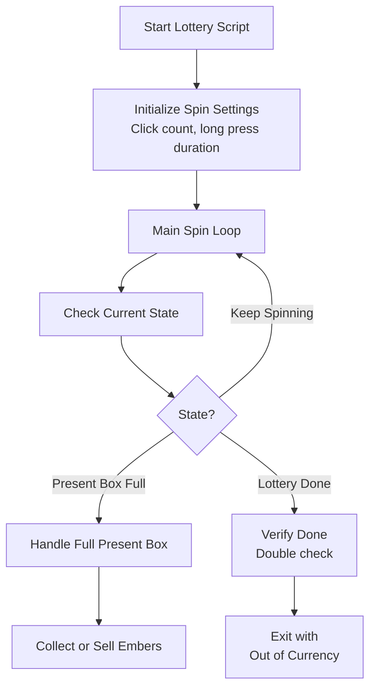
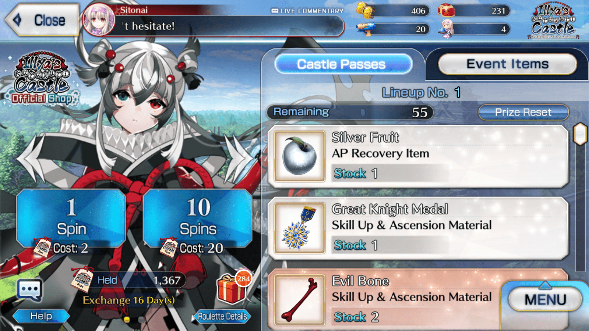
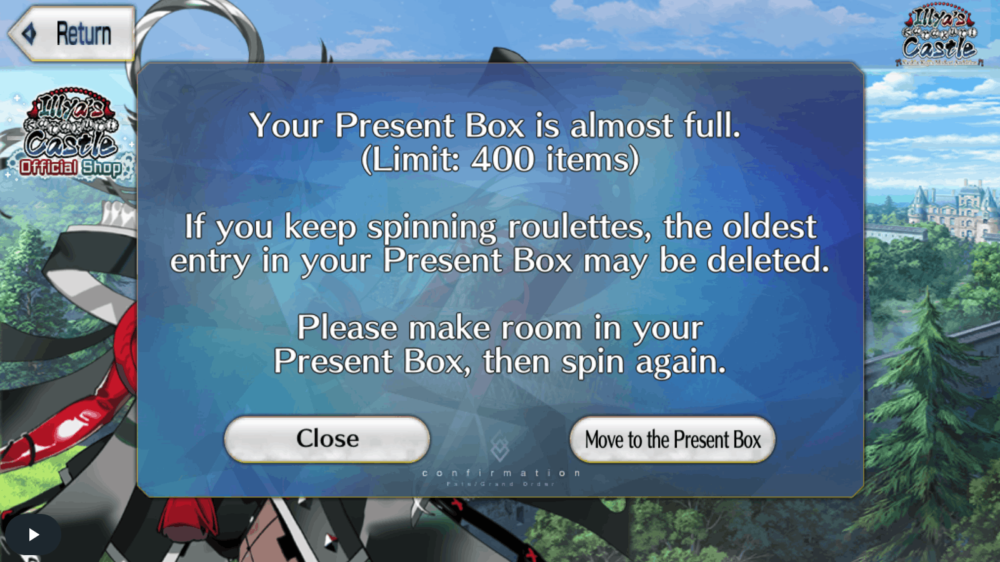

# Auto Lottery

Automatically spins lottery boxes during event lotteries to collect rewards efficiently.

## Overview

The Lottery script continuously opens lottery boxes during Fate/Grand Order events. It handles present box overflow and can redirect to collect embers or sell items when the present box becomes full.

## How to Start

1. Navigate to the **Event Lottery** screen in the game
2. The script will automatically detect the lottery screen when:
   - The lottery cost indicator is visible (JP/EN servers)
   - The lottery box finished indicator is visible
3. Make sure you have lottery currency (event items) to spend

## Workflow



## Key Features

### Server-Specific Spinning

- **JP Servers**: Uses long press spinning for faster lottery spins
- **Other Servers**: Uses rapid click spinning (configurable click count)

### Present Box Full Handling

When the present box becomes full, the script can:

1. **Collect Embers from Gift Box** - Opens gift box to receive gold embers
2. **Redirect to Sell Menu** - After collecting embers, redirect to sell excess items
3. **Stop the script** - Exit with a present box full notification

### Lottery Completion Detection

- Double-checks when lottery appears done to avoid false positives
- Verifies by attempting spins and checking if the "done" indicator persists

## Settings

| Setting                             | Description                                 |
| ----------------------------------- | ------------------------------------------- |
| Receive Embers When Gift Box Full   | Enable automatic ember collection           |
| Loop Into Lottery After Present Box | Return to lottery after collecting embers   |
| Move to Sell After Present Box      | Navigate to sell menu after collecting      |
| Max Gold Ember Total Count          | Limit on gold embers to collect per session |




## Spin Configuration

| Setting                   | Description                              |
| ------------------------- | ---------------------------------------- |
| Lotto Spin Count          | Number of clicks per spin cycle (non-JP) |
| Lotto Long Press Duration | Duration of long press for spinning (JP) |

## Exit Reasons

The script will stop and notify you when any of these conditions occur:

| Exit Reason                                    | Description                                      |
| ---------------------------------------------- | ------------------------------------------------ |
| **Ran Out of Currency**                        | No more lottery currency to spend                |
| **Present Box Full**                           | Present box is full and auto-collect is disabled |
| **No Embers Found**                            | Could not find embers in the gift box            |
| **Cannot Select Any More**                     | Reached the limit of selectable items            |
| **Present Box Full and Cannot Select Anymore** | Box is full and reached selection limit          |
| **Reached Sell Banner**                        | Successfully navigated to the sell menu          |
| **Unable to Verify Sell**                      | Could not verify navigation to sell menu         |
| **Aborted**                                    | Script was manually stopped by user              |



## Tips for Best Results

1. **Clear your present box** before starting for longer uninterrupted runs
2. **Set ember collection limits** to avoid unnecessary inventory management
3. **Enable auto-collect** to maximize lottery efficiency during events
4. **Ensure stable connection** as lotteries involve many rapid actions
5. **JP users**: The long press feature allows faster spinning

## Present Box Integration

When present box becomes full during lottery:

```text
┌─────────────────────────────────────────┐
│        Present Box Full Detected        │
└─────────────────────┬───────────────────┘
                      │
                      ▼
┌─────────────────────────────────────────┐
│    Is "Receive Embers" enabled?         │
└─────────────────────┬───────────────────┘
                      │
         ┌────────────┴────────────┐
         │ Yes                     │ No
         ▼                         ▼
┌─────────────────┐      ┌─────────────────┐
│ Navigate to     │      │ Exit: Present   │
│ Gift Box        │      │ Box Full        │
└────────┬────────┘      └─────────────────┘
         │
         ▼
┌─────────────────────────────────────────┐
│    Collect Gold Embers (AutoGiftBox)    │
└─────────────────────┬───────────────────┘
         │
         ▼
┌─────────────────────────────────────────┐
│    Is "Loop Into Lottery" enabled?      │
└─────────────────────┬───────────────────┘
         │
         ▼
   Return to Lottery or Exit
```
