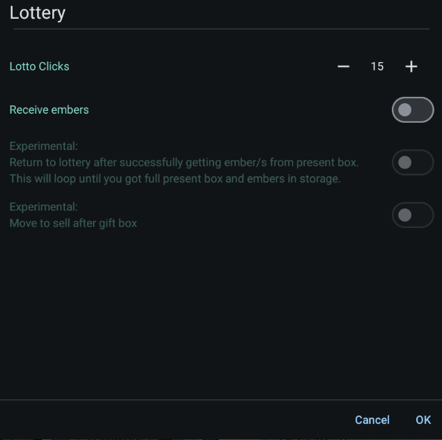
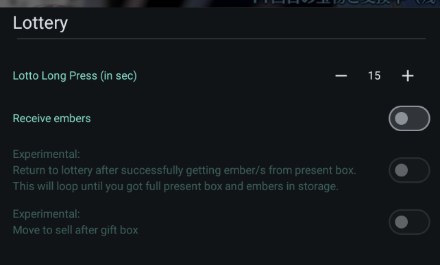
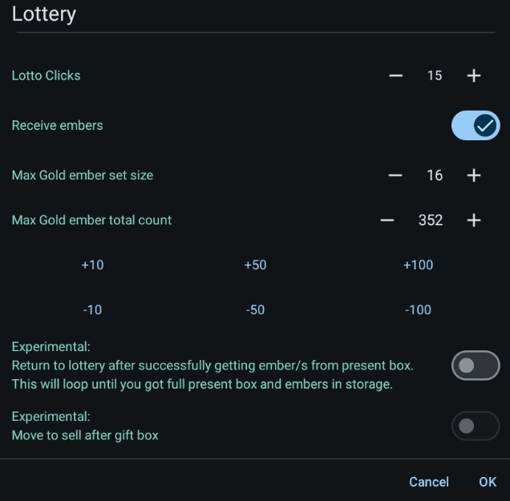
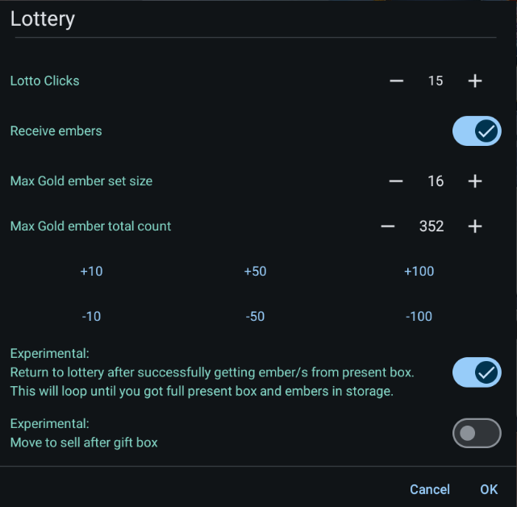
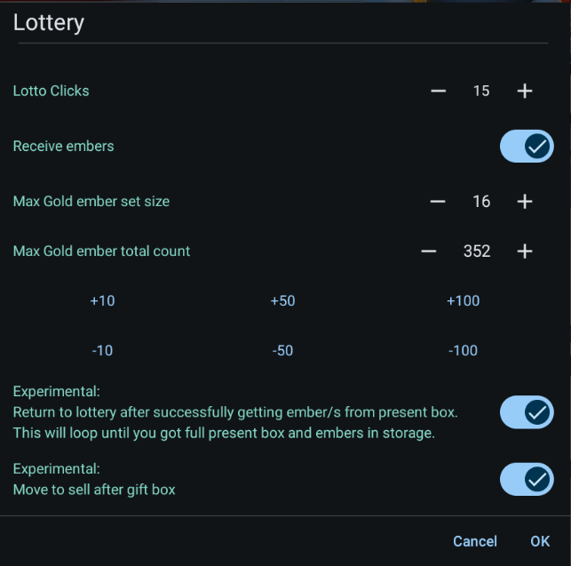

# Auto Lottery

This is the script that helps you automate the rolling of lottery.

## How to get started

1. Go to the Lottery Screen.

    

2. Click the Play button in order to setup the lottery configuration.

    

3. Click the "Ok" button to start the script.

## Lottery in JP

Lottery in JP server have implemented the long press option. This significantly improves the user experience by allowing for quicker rolling of the lottery.

We have implemented such feature to the app to help users.

## Lottery Options

1. If you want to receive embers when the gift box is full, enable the "Receive Embers" option.

    This will show the options also found on [Gift Box](gift-box.md) that is needed for receiving embers.

    

2. If you want to loop back to rolling the lottery, enable the "Return to lottery" option.

    

3. If both the Gift Box and Servant inventory are full, and want to redirect to "sell" screen

    enable the "Move to sell after Gift Box" option.

    

## Exit scenarios

The script ends when

1. The user manually stopped the script.
2. User didn't configure to receive embers.

    

3. Enabled to receive embers but found no embers.
4. Both the Gift Box and Servant inventory are full, and the user didn't configure to sell.
5. Both the Gift Box and Servant inventory are full, and the user configure to sell and have reached the sell screen.
