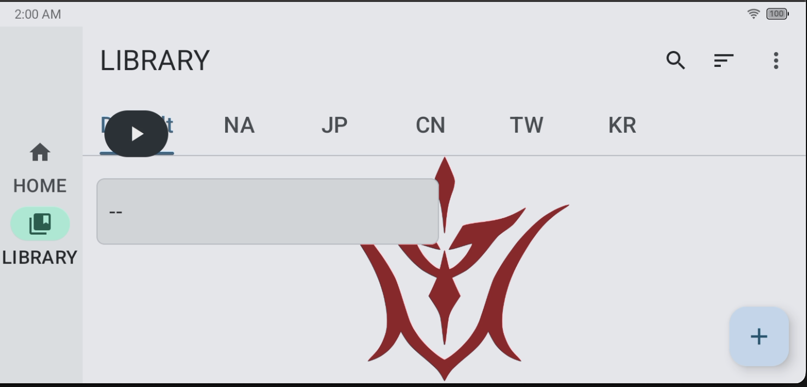
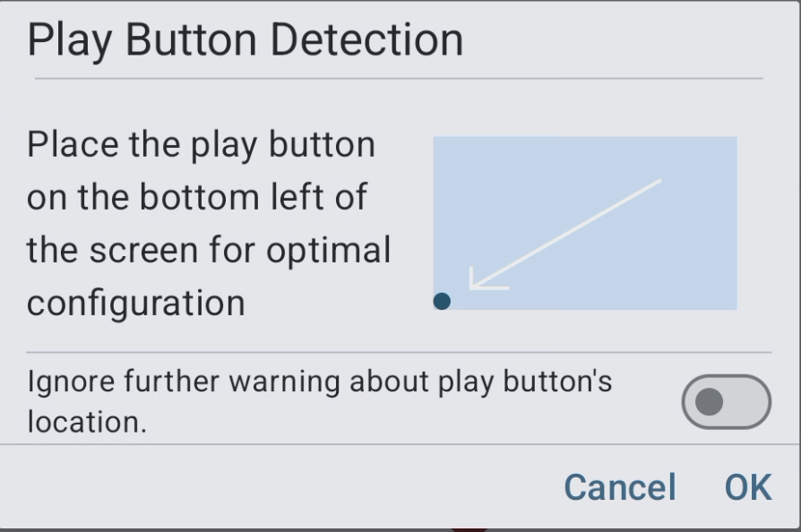

# Play Button Detection

This script tracks where the play button currently is.

Once the user clicks the play button and it is not in the optimal position (`bottom-left`), a warning is displayed automatically.

The user can choose to ignore the warning, but doing so may cause unexpected behavior, such as the play button covering parts of the screen required for image matching.

