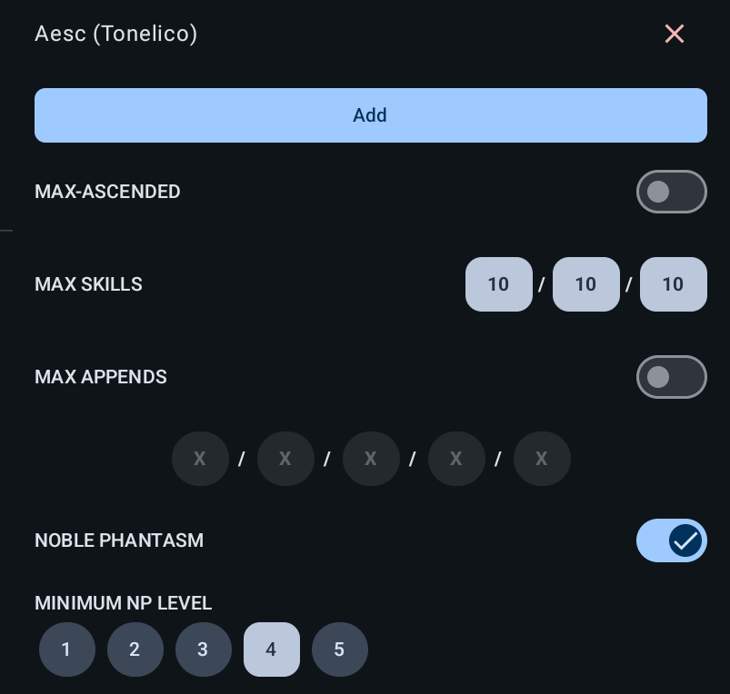
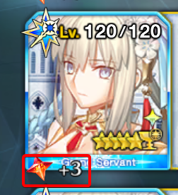
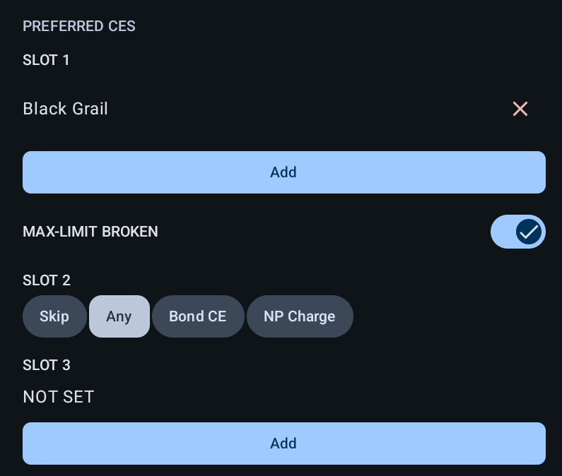
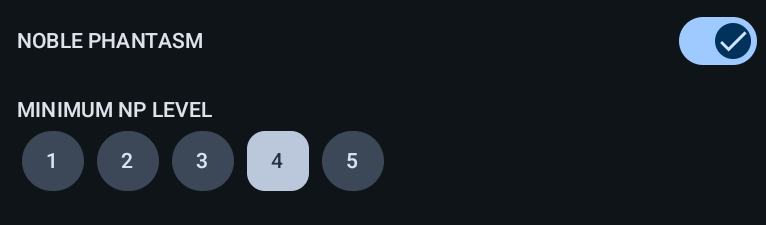

# Setup for Grand Duels

Configure FGA Preview to automatically select the best Grand Servant supports for Grand Duel events.

## Overview

Grand Duels are new special quest on the Japanese server where you battle using servants of a specific class. During these quests, you can only use servants matching the designated class, making support selection crucial for success.

FGA Preview includes special support for Grand Duels, allowing you to:

- **Target Grand Servants specifically** with enhanced filtering options
- **Configure all three CE slots** unique to Grand Servants
- **Set level requirements** to find the strongest supports

!!! warning "JP Server Only"
    Grand Servant features are currently only available on the **Japanese server** and **in Grand Duels**. The Grand Servant options will not appear if you're playing on other game servers.

---

## Introduction to Grand Duels

Grand Duels run for one week at a time, featuring a specific servant class each rotation. During the event:

- **Free Period**: For the first week, you can participate without consuming Storm Pods
- **After Free Period**: Battles will consume Storm Pods as usual
- **Class Restriction**: You can only bring servants of the featured class

The key advantage of Grand Duels is the ability to use **Grand Servants** from your support list—special support servants that can equip up to three Craft Essences.

---

## Normal Support vs Grand Servant Support

Grand Servants in the support selection screen have a distinct appearance compared to normal supports.


### Key Differences

| Feature              | Normal Support            | Grand Servant Support                        |
| -------------------- | ------------------------- | -------------------------------------------- |
| **Visual Indicator** | Standard servant card     | Special golden outline/icon                  |
| **CE Slots**         | 1 slot                    | 3 slots                                      |
| **NP level parsing** | Standard NP text position | Alternate NP text position for Grand layouts |
| **Availability**     | All quests                | Grand Duels only                             |

### Grand Servant CE Slots Explained

Grand Servants can equip up to three Craft Essences, each with specific restrictions:

| Slot       | CE Type            | Description                                                                                                                             |
| ---------- | ------------------ | --------------------------------------------------------------------------------------------------------------------------------------- |
| **Slot 1** | Any CE             | Works the same as normal support CEs. Can be any Craft Essence.                                                                         |
| **Slot 2** | Bond CE Only       | Limited to Bond CEs only. Players can choose between keeping the Bond CE effect or a 50% NP starting charge.                            |
| **Slot 3** | Mana Prism CE Only | Limited to [Mana Prism shop CEs](https://fategrandorder.fandom.com/wiki/Category:Shop_Craft_Essences) such as Bella Lisa, Teatime, etc. |

---

## How to Set Up Grand Duel Support in FGA

Follow these steps to configure FGA for Grand Duel support selection.

### Step 1: Access Preferred Support Settings

1. Open FGA Preview
2. Open or create a **Battle Config**
3. Tap **Support Selection**
4. Select **Preferred** mode
5. Tap **Preferred Support** to open the configuration screen

### Step 2: Configure Servant Selection



In the **Preferred Servants** section:

1. Tap **Add** to select servant images
2. Choose the Grand Servants you want to target
3. Tap **Save** to confirm

#### Grand Servant Tag Options

| Option              | Behavior                                                      | Preview                                                                                  |
| ------------------- | ------------------------------------------------------------- | ---------------------------------------------------------------------------------------- |
| **Any**             | Accept any servant (Grand or normal)                          |                               |
| **Level 100**       | Only accept Grand Servants at level 100 or higher             |            |
| **Above Level 100** | Only accept Grand Servants above level 100 (grailed servants) |  |

!!! tip
    Select **Above Level 100** if you want to ensure you're getting a fully-invested Grand Servant with maximum stats.

!!! warning
    The **Caster Grand Duel** runs concurrently with a Lotto event making it difficult to detect the tags due to the UI overlap with the lotto drops.

    In this case, it's recommended to use the **Any** option and rely on CE slot configuration to filter for Grand Servants.

    

### Step 3: Configure CE Slots



For Grand Servants, you need to configure all three CE slots:

#### Slot 1 (Main CE)

1. Tap **Add** under **CE Slot 1**
2. Select the Craft Essences you want
3. Enable **Max Limit Break (MLB)** if you only want fully limit broken CEs
4. Tap **Save**

#### Slot 2 (Bond CE)

Choose how FGA should handle the Bond CE slot:

| Option     | When to Use                                   |
| ---------- | --------------------------------------------- |
| **Skip**   | You don't care about the Bond CE slot         |
| **Any**    | Accept any Bond CE configuration              |
| **Bond**   | Only accept if using the Bond CE effect       |
| **Charge** | Only accept if using the 50% NP charge option |

#### Slot 3 (Mana Prism CE)

1. Tap **Add** under **CE Slot 3**
2. Select Mana Prism CEs (Bella Lisa, Teatime, etc.)
3. Enable **Max Limit Break (MLB)** if needed (Recommended)
4. Tap **Save**

!!! note
    Remember that Slot 3 only accepts Mana Prism shop CEs. If you select other CEs, they won't match Grand Servants.

---

## How FGA Detects Grand Servants

FGA automatically detects Grand Servants using the following workflow

```text
┌─────────────────────────────────────────┐
│       Start Support Selection           │
└─────────────────────┬───────────────────┘
                      │
                      ▼
         ┌────────────────────────┐
         │  Scan Support List     │
         └────────────┬───────────┘
                      │
                      ▼
         ┌────────────────────────┐
         │  Check for Grand CE    │
         │  Logo on Each Support  │
         └────────────┬───────────┘
                      │
           ┌──────────┴──────────┐
           │                     │
           ▼                     ▼
    ┌────────────┐        ┌────────────┐
    │   Grand    │        │   Normal   │
    │  Servant   │        │  Support   │
    └─────┬──────┘        └─────┬──────┘
          │                     │
          ▼                     ▼
    ┌────────────┐        ┌────────────┐
    │ Check All  │        │ Check CE   │
    │ 3 CE Slots │        │  Slot 1    │
    └────────────┘        └────────────┘
```

FGA enters "Grand Servant Mode" automatically when:

- You have CEs selected in **Slot 3**, OR
- You have a **Grand Servant Tag** option selected (not "Any"), OR
- You have a **Bond CE** option selected (not "Skip")

---

## Tips for Best Results

1. **Use NP Level Detection** - Select Grand Support Servants with higher NP levels for better performance.

    New Optical Character Recognition (OCR) model have improved NP level detection accuracy making it more reliable.

    

2. **Use Support Servant as Carry** - If possible, use a Grand Servant from your supports list as your main damage dealer to maximize synergy with support servants.

3. **Save Bond Grails** - Grand Duels offers high bond points. Use this opportunity to level up your Grand Servants' bond levels. **More bond level means more SQ rewards!**

---

## Related Documentation

- [Support Selection](../battle-setup/support.md) - Complete guide to support configuration
- [Support Image Maker](../other-scripts/support-image-maker.md) - How to create servant and CE images
- [Battle Config](../battle-setup/config.md) - Setting up battle configurations
