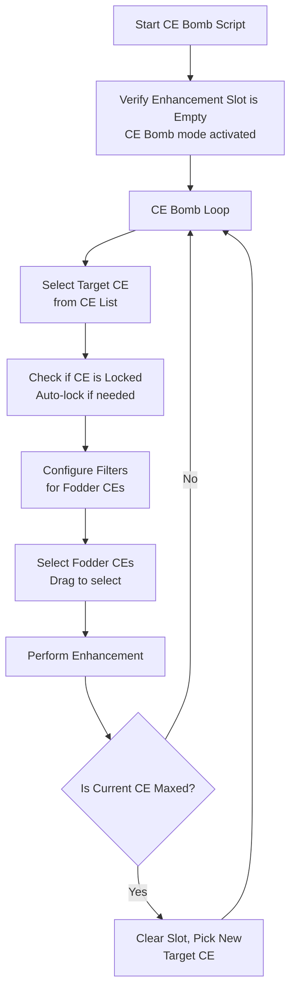

# Auto CE EXP Bomb

Automatically creates CE Bombs by continuously selecting and leveling Craft Essences.

## Overview

The CE Bomb script continuously creates leveled Craft Essences by automatically selecting target CEs and feeding them fodder CEs. Unlike Level CE mode, this mode will keep running until you stop it or run out of fodder, creating multiple "CE Bombs" that can later be used to level your important CEs.

## What is a CE Bomb?

A CE Bomb is a leveled CE that stores a large amount of CE experience. By feeding low-rarity CEs into another low-rarity CE (like a 1★), you can concentrate experience efficiently. These "bombs" can then be fed to your important CEs for massive experience gains.

## How to Start

1. Navigate to **Enhancement → Craft Essence** in the game
2. **Do NOT select any CE** - leave the enhancement slot empty
3. The script will automatically detect CE Bomb mode when:
   - The CE Enhancement banner is visible
   - The enhancement slot shows "Empty Enhance" state
4. Start the script

!!! tip "Important"
    The enhancement slot must be empty. If a CE is already selected, the script will run in Level CE mode instead.

## Workflow



Loop continues until:

- No more fodder CEs available
- No more target CEs available
- User stops the script

## Key Features

### Continuous Target Selection

- Automatically picks new target CEs when current one is maxed
- Filters target CEs based on your configured rarity
- Resets filters and position for each new target

### Auto-Lock Protection

- Automatically locks each target CE when selected
- Prevents target from being accidentally used as fodder
- Requires Android 8.0+ for long-press functionality

### Filter Automation

- Configures rarity filters for target CE selection
- Configures separate rarity filters for fodder CE selection
- Handles different CE types based on settings

### Position Management

- Scrolls to top of CE list for consistent selection
- Tracks which rows/columns have been exhausted
- Skips empty positions to save time

## Settings

| Setting                       | Description                           |
| ----------------------------- | ------------------------------------- |
| Target CE Rarity              | Rarity of CEs to use as bomb base     |
| Fodder CE Rarity              | Which CE rarities to use as fodder    |
| Skip Auto-Lock Target CE      | Don't automatically lock target CEs   |
| Skip Automatic Display Change | Don't auto-adjust display size        |
| Skip CE Filter Detection      | Don't auto-configure filters          |
| Skip Sort Detection           | Don't auto-configure sort options     |
| CE Display Change Area        | Which corner to tap to change display |


## Exit Reasons

The script will stop and notify you when any of these conditions occur:

| Exit Reason                     | Description                                                  |
| ------------------------------- | ------------------------------------------------------------ |
| **No Suitable Fodder CE Found** | No more fodder CEs available that match your filter criteria |
| **No Suitable Target CE Found** | No more target CEs available to use as bomb base             |

## Differences from Level CE Mode

| Feature        | CE Bomb                  | Level CE              |
| -------------- | ------------------------ | --------------------- |
| Target CE      | Auto-selected            | Pre-selected by user  |
| Starting state | Empty slot               | CE in slot            |
| Stop condition | Out of fodder/targets    | Target CE maxed       |
| Purpose        | Mass produce leveled CEs | Level one specific CE |
| Continuous     | Yes (loops)              | No (single CE)        |

## Recommended CE Bomb Strategy

### Using 1★ CEs as Bombs

1. Set **Target CE Rarity** to 1★
2. Set **Fodder CE Rarity** to 1★ and 2★ (optionally 3★)
3. Set Fodder filter to only Normal-type CEs
4. Let the script create multiple leveled 1★ MLB CEs
5. Use these 1★ bombs to level your important 4★ or 5★ CEs

### Experience Efficiency

```text
┌─────────────────────────────────────────┐
│           CE Experience Flow            │
└─────────────────────────────────────────┘

    1★ CEs ──┐
             ├──► 1★ MLB CE (Bomb) ──► Your 5★ CE
    2★ CEs ──┘

• Less QP cost than feeding all CEs directly
• More efficient inventory management
• Maximizes CE experience transfer
```

## Tips for Best Results

1. **Start with empty enhancement slot** to enable CE Bomb mode
2. **Use appropriate target rarity** (1★ CEs are common for bombs)
3. **Have plenty of fodder CEs** before starting long runs
4. **Monitor your QP** as enhancement costs add up
5. **Check locked CEs periodically** - all bombs will be locked

## Integration with FP Gacha

CE Bomb mode can be triggered automatically from the Friend Point Gacha script:

```text
FP Gacha ──► Inventory Full ──► CE Bomb Mode
                    │
                    ▼
            Create CE Bombs from
            summoned fodder CEs
```

This creates an efficient loop:

1. Summon FP gacha for fodder
2. When inventory full, create CE bombs
3. Return to summoning with cleared inventory

## Technical Notes

- Uses 7 columns × 4 rows grid for target CE selection
- Uses 7 columns × 3 rows grid for fodder CE selection
- Resets skip lists when selecting new target CE
- First run for each target includes initial setup (display, filters, sort)
- Subsequent fodder selections skip initial setup for speed
