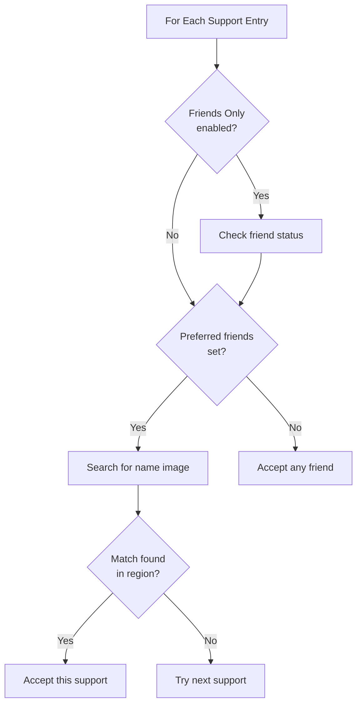

# Preferred Friend Selection

Configure FGA to filter support selection by friend status, or target specific friends by name for optimal farming rewards.

## Overview

Preferred Friend Selection allows you to restrict support selection to your friends list or prioritize specific friends. This is valuable because selecting friend supports provides bonus Friend Points compared to random players.

## Key Features

- **Friends Only mode**: Only select supports from your friends list
- **Preferred Friends**: Target specific friends by name
- **Guest and Follow support**: Automatically recognizes different friend statuses
- **Grand Servant compatible**: Works with JP server Grand Servant format

---

## Friends Only Mode

When enabled, FGA only selects support servants from players on your friends list.

### Friend Status Types

FGA recognizes three types of friend relationships:

| Status     | Icon        | Description                  |
| ---------- | ----------- | ---------------------------- |
| **Friend** | Friend icon | Mutual friends               |
| **Guest**  | Guest icon  | Random players (not friends) |
| **Follow** | Follow icon | Players you follow (one-way) |

With Friends Only enabled:

- **Friends** are accepted
- **Guests** are rejected
- **Follow** players are accepted (treated as friends)

### Why Use Friends Only

| Benefit                | Description                                       |
| ---------------------- | ------------------------------------------------- |
| **Friend Points**      | Using friend supports gives bonus FP              |
| **Reliable setups**    | Friends often maintain consistent support lineups |
| **Event coordination** | Friends may set up event CEs you need             |

---

## Preferred Friends

Beyond just filtering to friends, you can target specific friends by name.

### Adding Friend Names

1. Use the **Support Image Maker** to capture friend name images
2. Navigate to your Battle Config **Preferred Support** settings
3. Tap **Add** in the Friends section
4. Select one or more friend name images
5. Tap **Save** to confirm

### How Friend Name Matching Works

### Matching Priority

When both Friends Only and Preferred Friends are configured:

1. Support must be a friend (Friends Only check)
2. Support must match one of your preferred friend names
3. Support must still match servant/CE criteria

If no preferred friends are specified but Friends Only is enabled, any friend matching servant/CE criteria will be selected.

---

## Grand Servant Friend Matching

For JP server Grand Servants, friend name matching uses a different screen region optimized for the Grand Servant display format.

The friend name search area adjusts automatically:

| Support Type      | Search Region                            |
| ----------------- | ---------------------------------------- |
| **Normal**        | Standard friend region below servant     |
| **Grand Servant** | Adjusted region for Grand Servant layout |

This ensures friend name matching works correctly regardless of support format.

---

## Configuration Options

### Friends Only Toggle

| Setting      | Behavior                                 |
| ------------ | ---------------------------------------- |
| **Disabled** | Accept any support (friends and guests)  |
| **Enabled**  | Only accept friends and followed players |

### Preferred Friends List

| Configuration | Behavior                                    |
| ------------- | ------------------------------------------- |
| **Empty**     | Accept any friend (if Friends Only enabled) |
| **Has names** | Must match one of the specified friends     |

---

## Tips for Best Results

### Capturing Friend Names

- Use Support Image Maker for consistent captures
- Include the full friend name in the capture
- Avoid capturing when text is animating

### Friend Name Accuracy

- Friend names should be captured clearly
- Special characters in names may affect matching
- Update captures if friends change their names

### Balancing Speed and Preference

- Adding many preferred friends increases match chances
- Very specific friend targeting may slow down selection
- Consider using just Friends Only for faster matching

### Managing Friend Lists

- Coordinate with friends for event CE setups
- Remove inactive friends who may have outdated supports
- Add new friends with useful support configurations

---

## Troubleshooting

### No friends being found

- **Check friend list**: Ensure you have friends with the required class/servant
- **Verify friend status**: Some "friends" may actually be follows
- **Refresh the list**: Friends may not be immediately visible

### Preferred friend not selected

- **Verify name capture**: Friend names must match exactly
- **Check other criteria**: Servant and CE must also match
- **Consider name changes**: Friend may have changed their name

### Guest keeps getting selected

- Friends Only may not be enabled
- Check your support preferences
- Verify the support icon shows friend status, not guest

### Follow players not being accepted

- Follow players should be accepted like friends
- If issues occur, check for the Follow icon
- The system treats Follow as equivalent to Friend

### Grand Servant friend matching fails

- Ensure you're on JP server
- Friend name region differs for Grand Servants
- Recapture friend name if needed

---

## Related Documentation

- [Support Selection Modes](selection-modes.md) - Choose the right selection mode
- [Preferred Servant Selection](preferred-servant.md) - Configure servant matching
- [Support Image Maker](../other-scripts/support-image-maker.md) - Create friend name images
