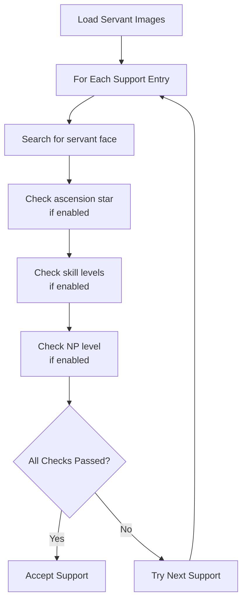

# Preferred Servant Selection

Configure FGA to search for specific support servants based on image matching and additional filters like skill levels, ascension status, and Noble Phantasm level.

## Overview

Preferred Servant Selection allows you to specify exactly which servants FGA should look for on the support screen. The app scans each support entry, comparing it against your configured servant images and optional requirements.

## Key Features

- **Image-based matching**: Select servants by their portrait image
- **Ascension filtering**: Only match servants showing max ascension artwork
- **Skill requirements**: Require specific skills to be at level 10
- **Append skill checking**: Verify append skill levels (JP supports 5, others support 3)
- **NP level requirements**: Set minimum Noble Phantasm level
- **Multiple servants**: Add several servants as acceptable options

---

## Setting Up Servant Selection

### Adding Servant Images

Before FGA can find servants, you need to capture their images:

1. Use the **Support Image Maker** script to capture servant portraits
2. Images are saved to your support images folder
3. Open your Battle Config and navigate to **Preferred Support**
4. Tap **Add** in the Servants section
5. Select one or more servant images
6. Tap **Save** to confirm

### Image Requirements

- Capture the servant's face/portrait area
- Update images after changing servant ascension artwork
- Use high-quality screenshots for better matching

---

## Servant Filters

### Max Ascended

When enabled, FGA only selects servants displaying the golden ascension star.

| Setting      | Behavior                                             |
| ------------ | ---------------------------------------------------- |
| **Disabled** | Accept any ascension level                           |
| **Enabled**  | Only accept servants with max ascension star visible |

This filter checks for the star indicator near the servant portrait, confirming they have reached final ascension artwork.

### Max Skills

Specify which skills must be at level 10:

| Display | Meaning                     |
| ------- | --------------------------- |
| **10**  | This skill must be level 10 |
| **X**   | Skill level doesn't matter  |

Example configurations:

| Configuration  | Meaning                              |
| -------------- | ------------------------------------ |
| `10 / 10 / 10` | All three skills must be maxed       |
| `10 / X / X`   | Only first skill must be maxed       |
| `X / 10 / X`   | Only second skill must be maxed      |
| `10 / X / 10`  | First and third skills must be maxed |

### Check Append Skills

When enabled, FGA also verifies append skill levels after checking regular skills.

**Append Skill Slots:**

| Server    | Available Slots |
| --------- | --------------- |
| **JP**    | 5 append skills |
| **Other** | 3 append skills |

The append skill check:

1. Toggles the skill display to show append skills
2. Checks each specified slot for level 10
3. Returns to regular skill display

Configure which append skills must be maxed similar to regular skills.

### Noble Phantasm Level

Set a minimum NP level requirement:

| NP Level | Meaning                |
| -------- | ---------------------- |
| **1**    | Any NP level (default) |
| **2**    | NP2 or higher          |
| **3**    | NP3 or higher          |
| **4**    | NP4 or higher          |
| **5**    | NP5 only               |

FGA reads the NP level from the support card using text recognition.

---

## How Servant Matching Works

### Matching Process

### Image Processing

FGA performs special processing when matching servant images:

- **Friend Lock Cropping**: Automatically removes the left portion of the image where a friend lock icon might appear
- This prevents locked friend icons from interfering with matching

### Filter Order

Filters are applied in sequence. If any filter fails, the support is rejected:

1. Servant image match
2. Grand Servant check (if configured)
3. Max ascension check
4. Regular skill check
5. NP level check
6. Append skill check (performed separately after initial match)

---

## Multiple Servant Configuration

You can add multiple servants as acceptable options:

| Configuration         | Behavior                               |
| --------------------- | -------------------------------------- |
| **Single servant**    | Only matches that specific servant     |
| **Multiple servants** | Matches ANY of the configured servants |

When multiple servants are configured, FGA selects the first match found while scrolling through the support list.

---

## Tips for Best Results

### Image Quality Matters

- Use Support Image Maker for consistent captures
- Recapture after ascension changes artwork
- Avoid capturing during animations or transitions

### Balance Strictness and Speed

- More filters = fewer matches = longer search time
- Start with fewer requirements and add more if needed
- Consider having backup servants with looser requirements

### Skill Verification Accuracy

- Skill level 10 detection uses image matching
- Similarity threshold is set to 68% by default
- If detection seems inaccurate, ensure good screen brightness

### NP Level Detection

- Uses text recognition (OCR) to read NP level
- Works best with clear, stable display
- May occasionally misread due to image quality

---

## Troubleshooting

### Servant not being found

- **Verify image quality**: Recapture using Support Image Maker
- **Check ascension**: If Max Ascended is enabled, ensure servant shows the star
- **Relax requirements**: Temporarily disable skill/NP checks

### Wrong servant selected

- Your image may match similar servants
- Capture a more distinctive portion of the portrait
- Add additional filter requirements to narrow matches

### Skills not detected correctly

- Ensure screen brightness is adequate
- Check that skill icons are fully visible
- Verify the skill display is showing regular skills (not append)

### Append skill check fails

- Confirm your server supports the number of append skills configured
- JP server: 5 slots, Other servers: 3 slots
- Check that the servant has append skills unlocked

### NP level always reads as 1

- Text recognition may fail with low image quality
- Try increasing screen brightness
- Ensure the NP level text is fully visible on the support card

---

## Related Documentation

- [Grand Servant Selection](grand-servant.md) - JP server Grand Servant features
- [Preferred CE Selection](preferred-ce.md) - Configure CE requirements
- [Support Image Maker](../other-scripts/support-image-maker.md) - Create support images
