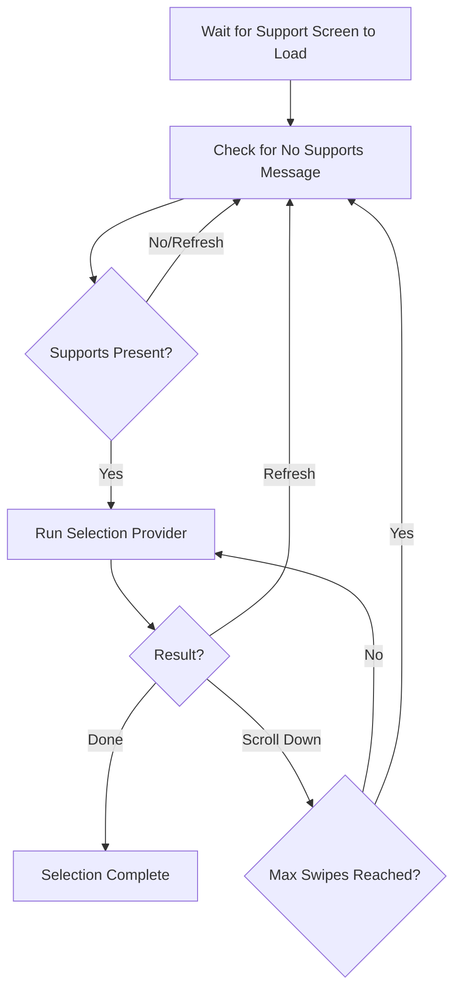
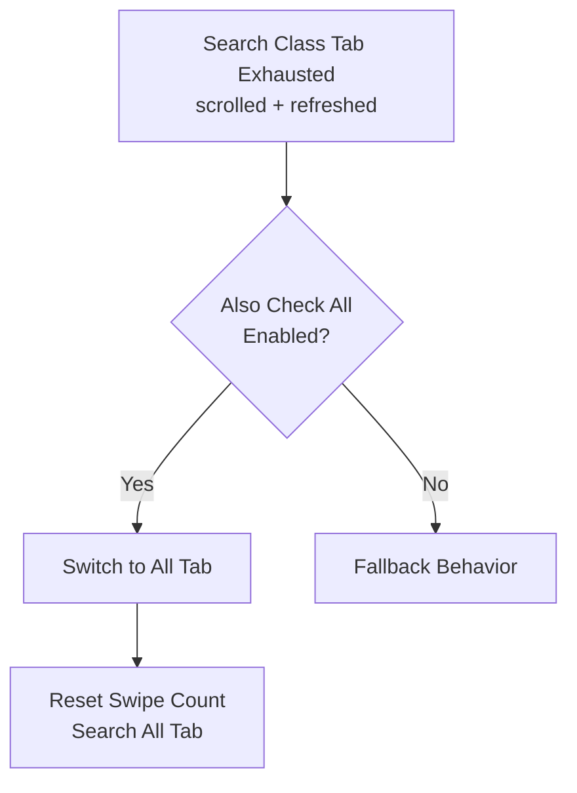

# Support List Refresh

Understand how FGA scrolls through and refreshes the support list when searching for preferred servants, including scroll limits, refresh timing, and automatic retry behavior.

## Overview

When FGA cannot find a matching support on the visible portion of the support list, it employs a systematic approach of scrolling down and refreshing the list. This guide explains the mechanics behind these behaviors.

## Key Features

- **Automatic scrolling**: Scrolls through the support list looking for matches
- **Smart refresh timing**: Waits for refresh button availability
- **Configurable limits**: Set maximum swipes and refresh attempts
- **Connection retry handling**: Automatic recovery from network issues
- **Early refresh detection**: Optimizes when no scrollbar is present

---

## Support Selection Loop

The support selection follows a structured loop:

---

## Scrolling Behavior

### Scroll Mechanism

FGA scrolls down the support list by performing a swipe gesture:

- Swipe starts from a position in the lower portion of the list
- Swipe ends at a position in the upper portion
- This smoothly scrolls the list down to reveal more supports

### Swipes Per Update

Configure the maximum number of scroll attempts before refreshing:

| Setting     | Description                         |
| ----------- | ----------------------------------- |
| **Default** | 10 swipes                           |
| **Low**     | Quick refresh cycles                |
| **High**    | Exhaustive scrolling before refresh |

After reaching the maximum swipes, FGA refreshes the list and starts from the top.

### Scrollbar Detection

FGA monitors the scrollbar position to optimize behavior:

| Scrollbar State  | Behavior                            |
| ---------------- | ----------------------------------- |
| **At Top**       | Continue scrolling down             |
| **Moved**        | Continue scrolling if not at bottom |
| **At Bottom**    | Trigger refresh (list exhausted)    |
| **No Scrollbar** | Early refresh (short list)          |

### Early Refresh

When the support list is short (no scrollbar), FGA performs an "early refresh" instead of attempting to scroll. This saves time when the current list cannot possibly contain more matches.

---

## Refresh Mechanism

### Refresh Process

1. **Check Availability**: Verify refresh button is available
2. **Wait if Needed**: Wait for refresh cooldown if button unavailable
3. **Click Refresh**: Tap the refresh button
4. **Confirm Dialog**: Click "Yes" on confirmation dialog
5. **Wait for Load**: Wait until new list is fully loaded
6. **Navigate to Class**: Return to configured class tab

### Refresh Button Availability

The game enforces a cooldown between refreshes. FGA handles this automatically:

- Checks if refresh button is currently available
- If unavailable, waits up to 10 seconds
- Proceeds with refresh once button becomes available

### Max Updates

Configure the maximum number of refresh attempts:

| Setting     | Description                    |
| ----------- | ------------------------------ |
| **Default** | 25 refreshes                   |
| **Low**     | Quick timeout, faster fallback |
| **High**    | More attempts to find match    |

After reaching the maximum refreshes without finding a match, FGA uses the fallback behavior.

---

## Connection Handling

FGA automatically handles connection issues during support selection:

### Retry Behavior

When a connection error is detected:

1. FGA identifies the error state
2. Waits for retry dialog if applicable
3. Attempts automatic reconnection
4. Continues support selection after recovery

### Dialog Handling

FGA monitors for dialog states:

- **Connection Error**: Triggers retry mechanism
- **Support Dialog Open**: Waits for dialog to close
- **Update Dialog**: Handles through connection retry

---

## Also Check All Integration

When "Also Check All" is enabled:

The "Also Check All" search:

- Resets the swipe counter
- Switches to the All class tab
- Performs a full search of that tab
- Only happens once before fallback

---

## Fallback Behavior

When no match is found after all attempts:

1. **Scroll to Top**: Returns list to the beginning
2. **Use Fallback Mode**: Based on support selection configuration
3. **Continue Script**: May select first available or exit

Fallback is triggered when:

- Maximum refreshes exceeded
- Both class tab and All tab (if enabled) exhausted
- No matching supports found anywhere

---

## Troubleshooting

### Refresh taking too long

- Refresh button may be on cooldown
- FGA waits up to 10 seconds for availability
- This is normal after recent refreshes

### List not loading after refresh

- Connection issues may be occurring
- FGA handles retries automatically
- Check your network connection

### Scrolling past matches

- Scroll speed may be too fast
- Swipe timing includes delay for stability
- Matches are checked between each swipe

### Refresh loop without progress

- No matching supports exist in friend list
- Requirements may be too strict
- Check configuration and relax constraints

### Class tab not switching after refresh

- Class selection happens after list loads
- Small delay is normal (0.5 seconds)
- Verify class setting in configuration

### "Also Check All" not triggering

- Only activates after class tab is exhausted
- Must scroll and refresh class tab first
- Check that option is enabled for your class

---

## Related Documentation

- [Selection Modes](selection-modes.md) - Overview of selection behavior
- [Class Selection](class-picker.md) - Class tab configuration
- [Preferred Servant Selection](preferred-servant.md) - Servant matching criteria
